## About

In this markdown, we will analyse the networks of TF/target gene cis-regulatory interactinos generated using ANANSE.

We will load these networks as tabular data that we will transform into `igraph` graph objects, that we can parse and annotate using our information on TF classes and other similar functional annotation that we have carried out over the course of this project.

## Load libraries


```r
library(igraph)
library(ComplexHeatmap)
library(circlize)
library(ggplot2)
library(ggpubr)
library(gridExtra)
library(ggplotify)
library(colorspace)
library(eulerr)
```

## Load functions


```r
source("code/r_code/r_functions/sourcefolder.R")

sourceFolder(
  "code/r_code/r_functions",
  recursive = TRUE
  )

sourceFolder(
  "code/r_code/r_general",
  recursive = TRUE
  )
```

## Load previous Data

We will need some of the information we have generated in our previous analyses such as stage-specific cluster information and Transcription factor annotation.


```r
# RNA clusters
load("outputs/rda/stage_specific_clusters.rda")

# Transcription Factor information
load("outputs/rda/TF_annotation.rda")
```

## Load and prepare information for graph analysis

Here we will load all the remaining information of our interest and we will transform it into a format compliant to some of the functions we have made to annotate the graphs; basically, tabular data with gene id <--> annotation category.


```r
# Transcription factors

allTFclasses_col <- c(topclasses_col,otherclasses_col)

pfla_tfs_graph_analysis <-
  merge(
    pfla_tfs,
    data.frame(
      TFclass = 
        c(names(topclasses_col),names(otherclasses_col)),
      col = 
        c(topclasses_col,otherclasses_col)
      ),
    by.x = 2,
    by.y = 1
  )[,c(2,1,3)]

colnames(pfla_tfs_graph_analysis) <- c("id","TFclass","col")

# Effector genes
pfla_tfeg <- data.frame(
  id = allgenes,
  TFEG = ifelse(allgenes %in% pfla_tfs$id, "TF", "EG")
)

# Functional categories (COG)
pfla_funcat <- read.table(
  "outputs/functional_annotation/COGs/pfla_cogs.tsv",
  col.names = c("id","funcat")
)

# Trans-developmental / housekeeping
pfla_td_nohk <- 
  unique(
    read.table(
      "outputs/functional_annotation/TD_annotation/transdev_expanded_nohk.tsv",
      header=F,
      stringsAsFactors = F)[,1]
    )

pfla_hk_notd <- 
  unique(
    read.table(
      "outputs/functional_annotation/TD_annotation/housekeep_expanded_notd.tsv",
      header=F,
      stringsAsFactors=F)[,1]
    )

pfla_tdhk <- data.frame(
  id = allgenes,
  TDHK =  
    ifelse(allgenes %in% pfla_td_nohk, "td",
    ifelse(allgenes %in% pfla_hk_notd, "hk", 
    "none")
    )
  )

#Insitu Hybridisation data
pfla_ISH <- read.delim2(
  "outputs/functional_annotation/germlayers_ISH/in_situ_data.tsv",
  header = TRUE
)[,c(1:4)]
```

We will also load the GO annotation of Ptychodera to use it later on in the functions.


```r
#gene universe
gene_universe <- allgenes

# gene-GO mappings
pfla_id_GO <-
  readMappings(
    "outputs/functional_annotation/go_blast2go/GO_annotation.txt"
  )
```

Likewise, we will also load the EggNOG annotation of gene names for more clarity in the plots of the graphs.


```r
pfla_genenames <-
  read.delim2(
    file = "outputs/functional_annotation/eggnog/emapper.annotations",
    skip = 3,
    header = TRUE
  )[,c(1,5,13)]
pfla_genenames <- pfla_genenames[pfla_genenames$predicted_gene_name != "",]
```

Finally, we add them into a list that our function for annotation will iterate through. We will call this the **list of attributes**


```r
pfla_attributes_list <- 
  list(
    pfla_tfeg,
    pfla_tfs_graph_analysis,
    pfla_funcat,
    pfla_tdhk,
    pfla_ISH,
    pfla_genenames
    )
```

## Load ANANSE outputs

Here we will use the function `LoadNetworkData` that reads the .network file replacing instances of em dash and other ANANSE-related quirks. The resulting dataframe has three columns: "tf" (transcription factor), "tg" (target gene), and "prob" (probability). We manually add back underscores to the gene ids because ANANSE required the gene ids in a different format.

We do this for both the Early Blastula (EB) and Late Gastrula (LG) networks.


```r
# EARLY BLASTULA
pfla_EB_nw <- LoadNetworkData("outputs/ananse/outs/network/EB.network")
# LATE GASTRULA
pfla_LG_nw <- LoadNetworkData("outputs/ananse/outs/network/LG.network")
```

Here it is what it looks like.


```r
head(pfla_EB_nw)
```

```
##                tf             tg      prob   tf_expr   tg_expr  w_binding
## 1: TCONS_00000010 TCONS_00000003 0.1657204 0.2021196 0.0000000 0.07585625
## 2: TCONS_00000010 TCONS_00000009 0.2884215 0.2021196 0.4669091 0.09975159
## 3: TCONS_00000010 TCONS_00000010 0.1949084 0.2021196 0.1926082 0.00000000
## 4: TCONS_00000010 TCONS_00000011 0.4023331 0.2021196 0.5854253 0.43688200
## 5: TCONS_00000010 TCONS_00000016 0.1467563 0.2021196 0.0000000 0.00000000
## 6: TCONS_00000010 TCONS_00000017 0.1467563 0.2021196 0.0000000 0.00000000
##     activity
## 1: 0.3849057
## 2: 0.3849057
## 3: 0.3849057
## 4: 0.3849057
## 5: 0.3849057
## 6: 0.3849057
```

## Early Blastula

The first thing we will do is filter the network and keep only those interactions whose values are in the top 5% percentile. We generate an `igraph` object using our custom wrapper `GenerateNetwork` that keep these interactions, since we provide `q = 0.95`.


```r
pfla_EB_graph <- GenerateNetwork(pfla_EB_nw, q = 0.95)
```

Using our list of attributes, we add this information to all the pertinent nodes (== genes) of our network using our ParseNetwork function.


```r
pfla_EB_parsenetwork <- ParseNetwork(pfla_EB_graph, pfla_attributes_list)
```

The resulting object can be subsetted to extract the new network with attributes on one object and the data frame of attributes on the other.


```r
g_EB <- pfla_EB_parsenetwork[[1]]
E(g_EB)$weight <- E(g_EB)$prob
```

The data frame of attributes is a data.frame object sorted in the same order as nodes are indexed in the igraph object. The content of this data frame is, for every node that has an attribute, a row with the id of this node, the index of this node, and a bunch of attributes (color, whether it is a trans-developmental gene, TF class, functional category, etc.)


```r
head(pfla_EB_parsenetwork[[2]])
```

```
##               id index TFEG  TFclass             col funcat TDHK germlayer
## 1 TCONS_00000855     1   TF Forkhead         #6dabd4      K none          
## 2 TCONS_00001049     2   TF    T-box         #f38d97      K none          
## 3 TCONS_00001141     3   TF  C2H2_ZF         #ffebb5      K none          
## 4 TCONS_00001174     4   TF     Runt lightgoldenrod2      Z none          
## 5 TCONS_00001186     5   TF     Runt lightgoldenrod2      Z none          
## 6 TCONS_00001304     6   TF  C2H2_ZF         #ffebb5      O   td          
##   germlayer_col gene predicted_gene_name
## 1                                   SPT7
## 2                                      T
## 3                                 ZNF721
## 4                                   ENAH
## 5                                   ENAH
## 6                                 MBTPS2
##                                            eggNOG.annot
## 1                                     acetyltransferase
## 2                          T, brachyury homolog (mouse)
## 3                                   Zinc finger protein
## 4                          Enabled homolog (Drosophila)
## 5                          Enabled homolog (Drosophila)
## 6 membrane-bound transcription factor peptidase, site 2
```

We calculate several graph metrics that will be of use in the comparison below.


```r
g_EB <- vertex_metrics(g_EB)
```

```
## degree
```

```
## outdegree
```

```
## indegree
```

```
## centrality, this might take a while...
```

```
## betweenness, this might take a while...
```

```
## tagging TFs
```

```
## tagging tgs
```

## Late Gastrula

Next we do the same for the Late Gastrula Network. We generate an `igraph` network using the same percentile.


```r
pfla_LG_graph <- GenerateNetwork(pfla_LG_nw,q = 0.95)
```

We parse this graph using our list of attributes


```r
pfla_LG_parsenetwork <- ParseNetwork(pfla_LG_graph, pfla_attributes_list)
g_LG <- pfla_LG_parsenetwork[[1]]
E(g_LG)$weight <- E(g_LG)$prob
```

And finally we calculate the stats and metrics of this network:


```r
g_LG <- vertex_metrics(g_LG)
```

```
## degree
```

```
## outdegree
```

```
## indegree
```

```
## centrality, this might take a while...
```

```
## betweenness, this might take a while...
```

```
## tagging TFs
```

```
## tagging tgs
```

## Comparing the networks

We will have a look at the output of these wrappers a bit later. We will now compare these two networks using the NetworkStats and the filtered tab-format networks that we have generated.

Part of this comparison involves defining a subset of genes of interest, which we load here.


```r
genes_postgr <- 
  rownames(pfla_rna_dev)[
    pfla_rna_dev$cID > 12
    ]
```

And another part is loading the results of running ANANSE influence, which takes into account differential gene expression to infer the responsible factors for changes in the networks of cis-regulatory interactions between two states (in our case, the transition from early blastula to late gastrula).


```r
ananse_EB_to_LG <- 
  read.table("outputs/ananse/outs/influence/EG_EB_influence.txt",header=T)
```

The `CompareNetworks` wrapper compares two networks, g_a and g_b, and outputs various metrics, visualizations, and data frames.

The function requires the following arguments:
  - `graph_a`: A `igraph` graph object for network A.
  - `graph_b`: A `igraph` graph object for network B.
  - `influence`: if present, it outputs subgraphs of, and visualisations of, the top factors explaining the transition (as estimated by ANANSE influence).
  - `name_network_a`: The name of network A. The default is "a".
  - `name_network_b`: The name of network B. The default is "b".
  - `geneset_interest`: if present, it compares the percentage of a set of genes of interest as targets in each of the networks.
  - `q_targets`: Quantile of top targets in each network to consider (based on indegree by default). The default is 0.9.
  - `tfs`: A table of TFs to use as template for retrieving centrality and other metrics.
  - `gene_universe`: A vector of all genes to be used as gene universe in GO analysis.
  - `id2go`: A data frame containing gene ontology (GO) annotations.

The function performs the following tasks:

  - Identifies the exclusive and common targets in each network, as well as with TFs and Trans-Dev genes.
  - For each of these categories, it puts together several data frames with vertex metrics such as centrality, betweenness, etc. for simplicity of access
  - Calculates various metrics for the two networks, such as the number of genes, active transcription factors (TFs), connections per TF and target gene (TG), and self-regulated TFs, and creates a data frame of the calculated metrics.
  - If present, it calculates how many genes of the `geneset_interest` list are present in the exclusive targets of each of the networks.
  - If present, it tidies up the influence results provided and creates a scatter plot and a subgraph of those top factors (using network B).
  - It generates sub-graphs of each of the networks, with the transcription factors found to have differences in centrality between each network, and the same for trans-devs.
  - If requested, it performs GO enrichment analysis for the common and exclusive TFs and TGs using topGO, and it returns the output (table of results and a barplot) (elim method vs the whole set of genes provided in `gene_universe`).


```r
EB_vs_LG <- CompareNetworks(
  name_network_a = "EB",
  name_network_b = "LG",
  g_a = g_EB, g_b = g_LG,
  q_targets = 0.9,
  influence = ananse_EB_to_LG,
  tfs = pfla_tfs_graph_analysis,
  geneset_interest = genes_postgr,
  id2go = pfla_id_GO,
  gene_universe = gene_universe
)
```

```
## [1] "Starting analysis 1 of 3"
## [1] "Starting analysis 2 of 3"
## [1] "Starting analysis 3 of 3"
## [1] "Starting analysis 1 of 3"
## [1] "Starting analysis 2 of 3"
## [1] "Starting analysis 3 of 3"
```

## Network plots

We will now explore the graph analyses by plotting and visualising. We will define the constants of colors.


```r
col_a = "#efaa90"
col_b = "#fbcf99"
```

We start by having a look at the number of genes and the number of TFs in each network:


```r
barplot(
 c(
    EB_vs_LG$comparative$a[1],
    EB_vs_LG$comparative$b[1]
    ),
  main = EB_vs_LG$comparative$metric[1],
  names.arg = c("EB","LG"),
  col = c(col_a,col_b),
  ylim = c(0,15000)
  )
```

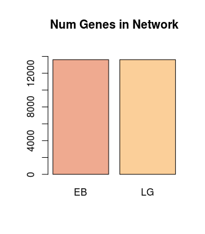<!-- -->

We also check the number of active TFs (nodes with outdegree > 0)


```r
barplot(
  c(
    EB_vs_LG$comparative$a[2],
    EB_vs_LG$comparative$b[2]
    ),
  main = EB_vs_LG$comparative$metric[2],
  col = c(col_a,col_b),
  ylim = c(0,350),
  names.arg = c("EB","LG")
)
```

<!-- -->

Then we look at the number of connections per target gene. This is done by counting the number of instances of each gene in the "target" column of the tabular networks.


```r
boxplot(
  main = "connections per\ntarget gene",
  list(
    V(g_EB)$indegree[V(g_EB)],
    V(g_LG)$indegree[V(g_LG)]
  ),
  names = c("\nEarly\nBlastula", "\nLate\nGastrula"),
  col = c(col_a,col_b),
  sub = paste0(
    "Wilcox p.value ",
    wilcox.test(
      x = V(g_EB)$indegree[V(g_EB)],
      y = V(g_LG)$indegree[V(g_LG)]
    )$p.value
  )
)
```

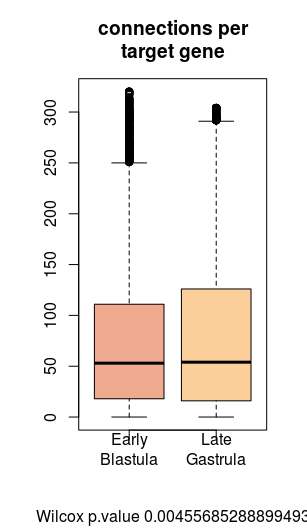<!-- -->

Relative oudegree of TFs in each network:


```r
boxplot(
  main = "relative outdegree",
  list(
    V(g_EB)$rel_outdegree[V(g_EB)$is_TF],
    V(g_LG)$rel_outdegree[V(g_LG)$is_TF]
  ),
  names = c("\nEarly\nBlastula", "\nLate\nGastrula"),
  col = c(col_a,col_b),
  sub = paste0(
    "Wilcox p.value ",
    wilcox.test(
      V(g_EB)$rel_outdegree[V(g_EB)$is_TF],
      V(g_LG)$rel_outdegree[V(g_LG)$is_TF]
    )$p.value
  )
)
```

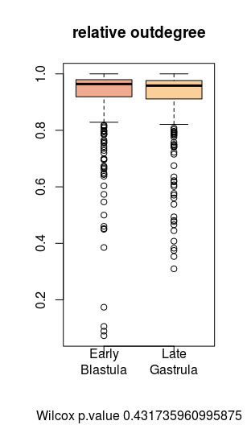<!-- -->

We can also have a look at the number of TFs that are self-regulated on each network by counting the number of times a given TF gene appears as a target of itself in the tabular networks.


```r
# Number of self-reg TFs
barplot(
 c(
    EB_vs_LG$comparative$a[5],
    EB_vs_LG$comparative$b[5]
    ),
  main = EB_vs_LG$comparative$metric[5],
  col = c(col_a,col_b),
  names.arg = c("EB","LG")
)
```

<!-- -->

For this we can look at the changes in centrality for different genes across networks.


```r
# plots of correlation changes in centrality tfs and transdev
par(mfrow = c(1,3))
plot(
  main = "Changes in TF centrality across networks",
  x = relativise(EB_vs_LG$centrality_changes$a),
  y = relativise(EB_vs_LG$centrality_changes$b),
  xlab = "Early Blastula",
  ylab = "Late Gastrula",
  pch = 19,
  col = alpha("#E58745",0.25)
)

plot(
  main = "Changes in centrality of TFs",
  x = relativise(EB_vs_LG$centrality_changes_TFs$a),
  y = relativise(EB_vs_LG$centrality_changes_TFs$b),
  pch = 19,
  col = alpha("#E58745",0.25),
  xlab = "Early Gastrula",
  ylab = "Late Gastrula"
)

plot(
  main = "Changes in trans-dev centrality\nacross networks",
  x = relativise(EB_vs_LG$centrality_changes_transdev$a),
  y = relativise(EB_vs_LG$centrality_changes_transdev$b),
  xlab="Early Blastula",
  ylab = "Late Gastrula",
  pch = 19,
  col = alpha("#1A9A83",0.25)
)
```

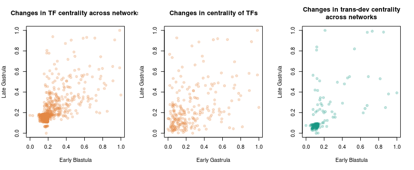<!-- -->

```r
par(mfrow = c(1,1))
```

In this case we see a large number of genes tend to acquire higher levels of centrality in LG compared to EB, as shown in the scatter plot and the plot of the foldchange.

And the same about trans-dev genes.

To have a better idea of what kind are the genes affected by these networks, and since we saw that there is a TF switch at the transcriptional level during development (see previous markdowns), we can showcase the changes in the network structure by looking at the centrality of the different genes by TF class.

In this case we use the function `plot_centrailty_TFclass` that grabs a named list with teh centrality values of TF genes grouped by class and creates a barplot. Colors are assigned based on the named vector with TFclasses and color.


```r
## Centrality per TF class
pfla_tfs_graph_analysis$TFclass <- factor(pfla_tfs_graph_analysis$TFclass, levels = unique(sort(pfla_tfs_graph_analysis$TFclass)))

EB_vs_LG$centrality_TFclass_a$class <- factor(EB_vs_LG$centrality_TFclass_a$class, levels = levels(pfla_tfs_graph_analysis$TFclass))
EB_vs_LG$centrality_TFclass_b$class <- factor(EB_vs_LG$centrality_TFclass_b$class, levels = levels(pfla_tfs_graph_analysis$TFclass))

allTFclasses_col <- allTFclasses_col[match(levels(pfla_tfs_graph_analysis$TFclass), names(allTFclasses_col))]

class_cent_plot <- as_ggplot( as.grob( function(){
par(mfrow = c(2,1))
set.seed(4344)
graphics::boxplot(
  main = "Early Blastula",
  relativise(EB_vs_LG$centrality_TFclass_a$centr)~EB_vs_LG$centrality_TFclass_a$class,
  ylab = "relative centrality",
  xlab = "",
  col = allTFclasses_col, border = colorspace::darken(allTFclasses_col, .5),
  las = 2,
  cex.axis = .8,
  outline = F
)
stripchart(
  relativise(EB_vs_LG$centrality_TFclass_a$centr)~EB_vs_LG$centrality_TFclass_a$class,
  col = colorspace::darken(allTFclasses_col, .6),
  method = "jitter",
  jitter=0.15,
  vertical = TRUE,
  pch = 20,
  cex=0.8,
  add = TRUE
)
set.seed(4344)
graphics::boxplot(
  main = "Late Gastrula",
  relativise(EB_vs_LG$centrality_TFclass_b$centr)~EB_vs_LG$centrality_TFclass_b$class,
  ylab = "relative centrality",
  xlab = "",
  col = allTFclasses_col, border = colorspace::darken(allTFclasses_col, .5),
  las = 2,
  cex.axis = .8,
  outline = F
)
stripchart(
  relativise(EB_vs_LG$centrality_TFclass_b$centr)~EB_vs_LG$centrality_TFclass_b$class,
  col = colorspace::darken(allTFclasses_col, .6),
  method = "jitter",
  jitter=0.15,
  vertical = TRUE,
  pch = 20,
  cex=0.8,
  add = TRUE
)
par(mfrow = c(1,1))
}))

grid.draw(class_cent_plot)
```

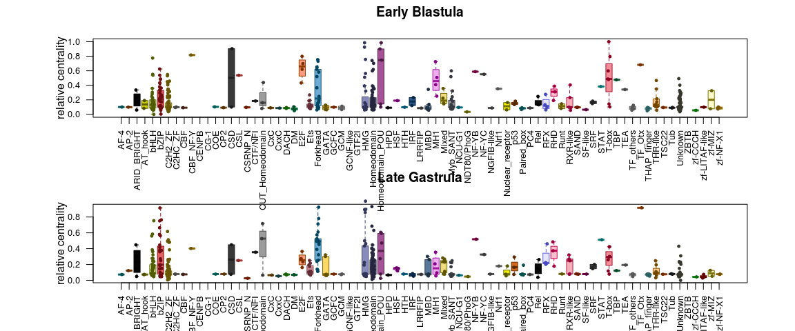<!-- -->

How different are these networks at the target level? We can dig into this by looking at how overlapped these networks are, and at the enriched GO terms in the exclusive and commonly-shared target genes of each network.


```r
fit_tg <- euler(calc_overlaps(EB_vs_LG$tg_overlap_top))
cols_venn <- c(col_a,col_b)
plot(
  fit_tg,
  fills = alpha(cols_venn,0.45),
  edges = darken(cols_venn,.5),
  quantities = list(type = c("counts", "percent"))
)
```

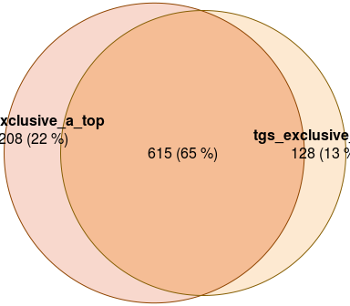<!-- -->


```r
fit_tf <- euler(calc_overlaps(EB_vs_LG$TF_overlap))
cols_venn <- c(col_a,col_b)
plot(
  fit_tf,
  fills = alpha(cols_venn,0.45),
  edges = darken(cols_venn,.5),
  quantities = list(type = c("counts", "percent"))
)
```

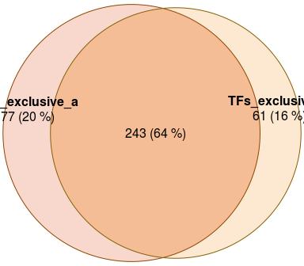<!-- -->


We can see there is a major switch-on of TFs! What are they doing and what genes are they regulating? Here we have the enriched GO terms for the target genes exclusive to EB, the target genes exclusive to LG, and the common ones.


```r
plot_grid(
  EB_vs_LG$GOs_targets$GOplot$tgs_exclusive_a_top,
  EB_vs_LG$GOs_targets$GOplot$tgs_exclusive_b_top,
  EB_vs_LG$GOs_targets$GOplot$tgs_common_ab_top,
  ncol = 1
)
```

<!-- -->

Here the GO terms of the exclusive and common TFs of each network, using the totality of TFs as universe (for reference):


```r
plot_grid(
  EB_vs_LG$GOs_TFs$GOplot$TFs_exclusive_a,
  EB_vs_LG$GOs_TFs$GOplot$TFs_exclusive_b,
  EB_vs_LG$GOs_TFs$GOplot$TFs_common_ab,
  ncol = 1
)
```

<!-- -->

Another way to check for differences between target genes in networks is looking at the presence of certain genes of interest in each. For example, we can check how many genes of larval development are being targeted in each of the networks. We see there is a large different in the proportion of larval genes that are embedded in the LG network compared to the EB network. This is hinting at the aforementioned switch towards larval development already taking place at the cis-regulatory level during gastrulation.


```r
# number of post-gastrulation genes in network
barplot(
  main="network-specific targets\nin post-gastrulation clusters",
  height=c(
    EB_vs_LG$comparative$a[15]/length(EB_vs_LG$tg_overlap$tgs_exclusive_a)*100,
    EB_vs_LG$comparative$b[15]/length(EB_vs_LG$tg_overlap$tgs_exclusive_b)*100
  ),
  col = c(col_a,col_b),
  border = darken(c(col_a,col_b),.4),
  names=c("EB", "LG"),
  ylab="gene percent",
  ylim = c(0,100),
  las=1
)
```

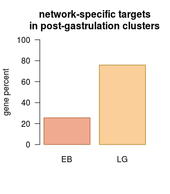<!-- -->

Here we can see what are the functional categories of the genes whose relative out-degree (number of outgoing vs incoming connections) change between stages. Here we see that signal transduction has a small increase only in gastrulation.


```r
funcat <- as_ggplot( as.grob( function(){
  par(mfrow = c(2,1))
  barplot(
    main = "EB",
    log1p(table(factor(pfla_funcat$funcat, levels = LETTERS)[
      pfla_funcat$id %in% V(g_EB)$name[V(g_EB)$rel_outdegree > 0.5]
      ] )),
    col = colorspace::lighten(desaturate(rainbow(26),.3)),
    border = colorspace::darken(desaturate(rainbow(26),.3),.5)
    )
  barplot(
    main = "LG",
    log1p(table(factor(pfla_funcat$funcat, levels = LETTERS)[
      pfla_funcat$id %in% V(g_LG)$name[V(g_LG)$rel_outdegree > 0.5]
      ] )),
    col = colorspace::lighten(desaturate(rainbow(26),.3)),
    border = colorspace::darken(desaturate(rainbow(26),.3),.5)
    )
  par(mfrow = c(1,1))
  } ))

grid.draw(funcat)
```

<!-- -->


```r
# in EB
chisq_cog_EB_tgs <- 
  make_chisq_heatmap(chisq_and_posthoc(
    table(
      pfla_funcat$funcat,
      ifelse(pfla_funcat$id %in% EB_vs_LG$tg_overlap$tgs_exclusive_a, "EB_tg", "non_EB_tg")
      )
    ))

# in LG
chisq_cog_LG_tgs <- 
  make_chisq_heatmap(chisq_and_posthoc(
    table(
      pfla_funcat$funcat,
      ifelse(pfla_funcat$id %in% EB_vs_LG$tg_overlap$tgs_exclusive_b, "LG_tg", "non_LG_tg")
      )
    ))

# common
chisq_cog_common_tgs <- 
  make_chisq_heatmap(chisq_and_posthoc(
    table(
      pfla_funcat$funcat,
      ifelse(pfla_funcat$id %in% EB_vs_LG$tg_overlap$tgs_common_ab, "common_tg", "non_common_tg")
      )
    ))

# Internal comparison between themselves
pfla_cogs_tg_internal <-
  merge(
    pfla_funcat,
    data.frame(
      id = unlist(EB_vs_LG$tg_overlap),
      tg =rep(names(EB_vs_LG$tg_overlap), times = sapply(EB_vs_LG$tg_overlap,length))
    ),
    by.x = 1, by.y = 1
  )

chisq_cog_EB_tgs_internal <- 
  make_chisq_heatmap(chisq_and_posthoc(
    table(
      pfla_cogs_tg_internal$funcat,
      pfla_cogs_tg_internal$tg
    )
  ))

# plots
draw(
  chisq_cog_EB_tgs$heatmap %v%
  chisq_cog_common_tgs$heatmap %v%
  chisq_cog_LG_tgs$heatmap %v%
  chisq_cog_EB_tgs_internal$heatmap
)
```

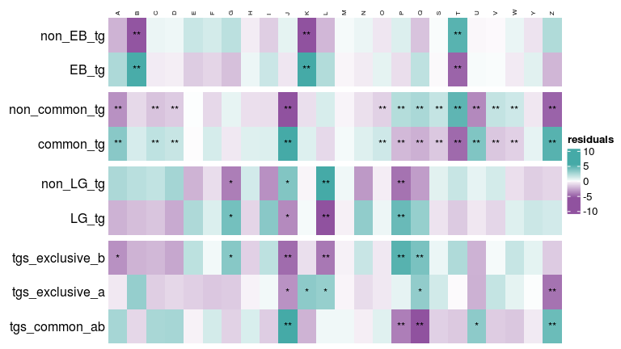<!-- -->

Finally, to check the differences between the networks of these developmental stages, we can use the output of ANANSE influence to check for the top factors.

Here the plot of ANANSE influence. Colors indicate different TF classes. Where available, gene names have been added.


```r
grid.draw(EB_vs_LG$influence_results$influence_plot)
```

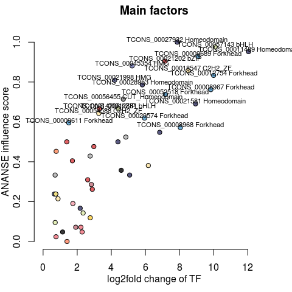<!-- -->

And here is the plot of the graph of these TFs:


```r
g_inf <- EB_vs_LG$influence_results$influence_subgraph
V(g_inf)$genename <- 
  translate_ids(V(g_inf)$name,pfla_genenames)

E(g_inf)$width <-
  category_by_quantile(
    E(g_inf)$prob,
    newvalues = c(0.2,1,2,3.5)
    )

V(g_inf)$col[V(g_inf)$col == ""] <- "gray"
V(g_inf)$genename <-
  gsub("TCONS_","", V(g_inf)$genename)
V(g_inf)$genename[V(g_inf)$genename == "T"] <- "BRA"

set.seed(1234)
plot(
  main = "Influence network",
  g_inf,
  vertex.size = 5*log1p(V(g_inf)$size),
  vertex.color = V(g_inf)$col,
  vertex.label.family = "Helvetica",
  vertex.label.color = "black",
  vertex.label.cex = .75,
  vertex.label = V(g_inf)$genename,
  vertex.label.dist = 1,
  edge.width = E(g_inf)$width,
  edge.arrow.size = 0.3,
  edge.color = rgb(0,0,0,0.1),
  layout = layout_with_fr(g_inf)
)
```

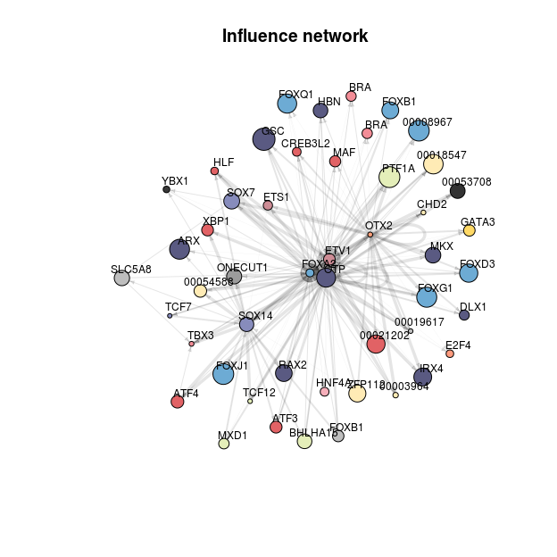<!-- -->

## Networks of germ layers

We were interested in knowing whether we can see interactions between genes which are expressed at specific germ layers. For this we crossed our data with in situ hybridisation data, and decided to sub-set the LG graph.

First we generate logicals to retrieve the genes that are expressed in ectodeerm, in mesoderm, and in endoderm respectively.


```r
ecto_genes <- which(
  V(g_LG)$germlayer== "Ectoderm")

meso_genes <- which(
  V(g_LG)$germlayer== "Mesoderm" |
  V(g_LG)$germlayer=="EctoMeso" |
  V(g_LG)$germlayer=="EndoMeso" |
  V(g_LG)$germlayer== "All" &
  V(g_LG)$name != "TCONS_00004384"# this gene is not connected to anything
)

endo_genes <- which(
  V(g_LG)$germlayer== "Endoderm" |
  V(g_LG)$germlayer=="EndoEcto" |
  V(g_LG)$germlayer=="EndoMeso" |
  V(g_LG)$germlayer== "All"
) 
```

We subsetted the LG graph


```r
#ectoderm
ecto_graph <- induced_subgraph(
  g_LG,
  vids = ecto_genes,
  impl = "auto"
)
ecto_graph <- subgraph_with_top_edges_per_tg(ecto_graph,top = 2,mode="in")
V(ecto_graph)$genename <- translate_ids(x = V(ecto_graph)$name , dict = pfla_ISH[,c(1,4)])
ecto_graph$weight <- cut(E(ecto_graph)$width,breaks = quantile(E(ecto_graph)$width), include.lowest = TRUE, labels = FALSE)
V(ecto_graph)$col[V(ecto_graph)$col == ""] <- "lightgray"

#mesoderm
meso_graph <- induced_subgraph(
  g_LG,
  vids = meso_genes,
  impl = "auto"
)
meso_graph <- subgraph_with_top_edges_per_tg(meso_graph, top = 2,mode="in")
V(meso_graph)$genename <- translate_ids(x = V(meso_graph)$name , dict = pfla_ISH[,c(1,4)])
meso_graph$weight <- cut(E(meso_graph)$width,breaks = quantile(E(meso_graph)$width), include.lowest = TRUE, labels = FALSE)
V(meso_graph)$col[V(meso_graph)$col == ""] <- "lightgray"

#endoderm
endo_graph <- induced_subgraph(
  g_LG,
  vids = endo_genes,
  impl = "auto"
)
endo_graph <- subgraph_with_top_edges_per_tg(endo_graph,top = 2,mode="in")
V(endo_graph)$genename <- translate_ids(x = V(endo_graph)$name , dict = pfla_ISH[,c(1,4)])
endo_graph$weight <- cut(E(endo_graph)$width,breaks = quantile(E(endo_graph)$width), include.lowest = TRUE, labels = FALSE)
V(endo_graph)$col[V(endo_graph)$col == ""] <- "lightgray"
```

And finally we plot the graphs


```r
germlayer_graphs <- as_ggplot( as_grob( function(){
par(mfrow = c(3,1))
#ectoderm
set.seed(1234)
plot(
  main = "Ectoderm graph",
  ecto_graph,
  vertex.color = V(ecto_graph)$germlayer_col,
  vertex.label = V(ecto_graph)$genename,
  vertex.size = 8,
  vertex.label.family = "Helvetica",
  vertex.label.color = "black",
  edge.width = ecto_graph$weight,
  vertex.label.cex = .9,
  edge.arrow.size = 0.2,
  edge.color = rgb(0,0,0,0.1),
  layout = layout.graphopt(ecto_graph)
)

#mesoderm
set.seed(1234)
plot(
  main = "Mesoderm graph",
  meso_graph,
  vertex.color = V(meso_graph)$germlayer_col,
  vertex.label = V(meso_graph)$genename,
  vertex.size = 8,
  vertex.label.family = "Helvetica",
  vertex.label.color = "black",
  vertex.label.cex = .9,
  edge.width = meso_graph$weight,
  edge.arrow.size = 0.2,
  edge.color = rgb(0,0,0,0.1),
  layout = layout.graphopt(meso_graph)
)

#endoderm
set.seed(1234)
plot(
  main = "Endoderm graph",
  endo_graph,
  vertex.color = V(endo_graph)$germlayer_col,
  vertex.label = V(endo_graph)$genename,
  vertex.size = 8,
  vertex.label.family = "Helvetica",
  vertex.label.color = "black",
  vertex.label.cex = .9,
  edge.width = endo_graph$weight,
  edge.arrow.size = 0.2,
  edge.color = rgb(0,0,0,0.1),
  layout = layout.graphopt(endo_graph)
)
par(mfrow = c(1,1))
}))

grid.draw(germlayer_graphs)
```

<!-- -->

Since we detected a relationship between centrality in the graph and expression ubiquity, we decided to see if these differences can also be detected at the gene annotation level by having a look at the GO terms of the TFs in LG, sorted and classified by their level of centrality in the graph.

First we retrieve the TFs and their values of centrality, and have a look at their distribution of values. 


```r
tfs_centr <- EB_vs_LG$centrality_TFclass_b

plot(density(tfs_centr$centr))
abline(v=quantile(tfs_centr$centr, c(0, .33, .67, 1)), col = desaturate(lighten(rainbow(4),.4),.4), lwd = 2)
```

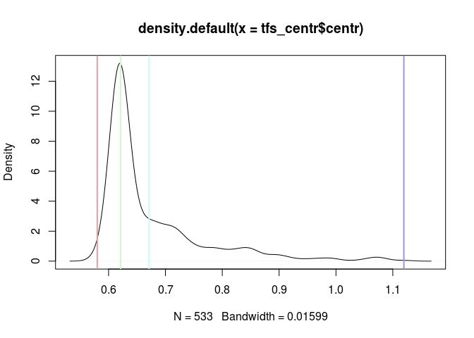<!-- -->

One possible approximation could be, as seen in the plot, by using quantiles. We will classify the TFs based on these quantiles, group them in a list, and do the GO term analysis.


```r
qs <- cut(tfs_centr$centr, breaks = quantile(tfs_centr$centr, c(0, 0.33, 0.67, 1)), labels = FALSE, include.lowest = TRUE)

grouped_tfs <- split(tfs_centr$id, qs)

names(grouped_tfs) <- c("low_central","mid_central","high_central")

gos_by_tfcentr <- getGOs(
  genelist = grouped_tfs,
  gene_universe = tfs_centr$id,
  alg = "elim",
  gene2GO = pfla_id_GO
)
```

```
## [1] "Starting analysis 1 of 3"
## [1] "Starting analysis 2 of 3"
## [1] "Starting analysis 3 of 3"
```


```r
plot_grid(
  gos_by_tfcentr$GOplot$low_central,
  gos_by_tfcentr$GOplot$mid_central,
  gos_by_tfcentr$GOplot$high_central,
  ncol = 1
)
```

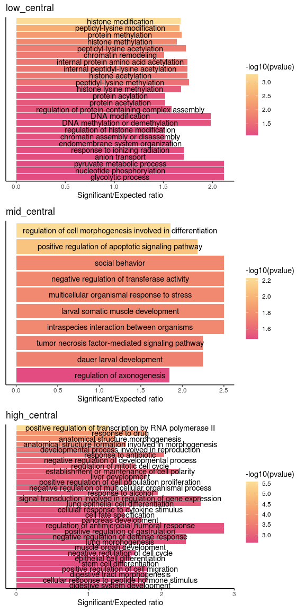<!-- -->

## Save the Data

We will save the data now:


```r
save(
  # Attributes
  pfla_attributes_list,
  # Early Blastula
  pfla_EB_graph,
  pfla_EB_parsenetwork,
  g_EB,
  # Late Gastrula
  pfla_LG_graph,
  pfla_LG_parsenetwork,
  g_LG,
  # Network comparison
  EB_vs_LG,
  file = "outputs/rda/graph_analysis.rda"
)
```


