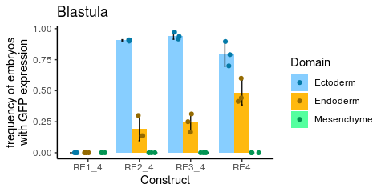
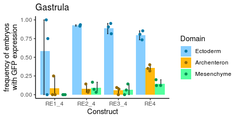
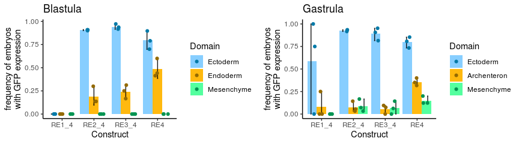

## About

In this markdown, we will plot the results of the reporter construct injections using ggplot2 and dplyr.

## Load libraries


```r
library(dplyr)
library(ggplot2)
library(colorspace)
library(cowplot)
```

## Load Data


```r
df <- read.delim2("data/Reporter_assay/FoxA_Injections.tsv", header = TRUE)

domain_cols_b <- c(
  Ectoderm = "skyblue1",
  Endoderm = "darkgoldenrod1",
  Mesenchyme = "seagreen1")

domain_cols_g <- c(
  Ectoderm = "skyblue1",
  Archenteron = "darkgoldenrod1",
  Mesenchyme = "seagreen1")
```

## Blastula injections


```r
# Keep Blastula, calculate percentage
inj_b <- df[df$Stage=="Blastula",-1]
```


```r
inj_b$pct_gfp <- inj_b$N_GFP / inj_b$Total_GFP
inj_b$pct_gfp[is.nan(inj_b$pct_gfp) | inj_b$Total_GFP < 3] = 0
```


```r
# turn characters into factors
is_char <- sapply(inj_b,is.character)
inj_b[,is_char] <-
  as.data.frame(lapply(
    inj_b[,is_char],
    function(x){factor(x,levels = unique(x))}
    ))
levels(inj_b$Domain) <- c("Ectoderm", "Endoderm", "Mesenchyme")
```


```r
# individual data points
inj_b = inj_b %>% 
  group_by(Construct,Domain) %>% 
  dplyr::mutate(mean = mean(pct_gfp), sd = sd(pct_gfp), minval = min(pct_gfp), maxval = max(pct_gfp))
```


```r
# summarised for the bar chart
inj_b_summ = inj_b %>% 
  summarise(mean = mean(pct_gfp), sd = sd(pct_gfp), minval = min(pct_gfp), maxval = max(pct_gfp), .groups = "drop") %>% 
  group_by(Construct,Domain)
```


```r
set.seed(1234)
p_inj_b <-
  ggplot(
    inj_b_summ,
    aes(x = Construct, y = mean, ymin=mean-sd, ymax=mean+sd, fill = Domain)
    ) +
  geom_bar(stat = "identity", position = position_dodge())+
  geom_errorbar(width=0.1, alpha=0.9, position = position_dodge(1))+
  geom_jitter(
    aes(x = Construct, y = pct_gfp, col = Domain),
    data = inj_b, position = position_jitterdodge(jitter.width = .4)
    )+
  scale_fill_manual(values = domain_cols_b) +
  scale_color_manual(values = darken(domain_cols_b, .4)) +
  theme_classic()+
  ggtitle("Blastula")+
  xlab("Construct")+
  ylab("frequency of embryos\nwith GFP expression")
  

print(p_inj_b)
```

<!-- -->

## Gastrula injections


```r
# GASTRULA
inj_g <- df[df$Stage=="Gastrula",-1]
```


```r
inj_g$pct_gfp <- inj_g$N_GFP / inj_g$Total_GFP
inj_g$pct_gfp[is.nan(inj_g$pct_gfp) | inj_g$Total_GFP < 3] = 0
```


```r
# turn characters into factors
is_char <- sapply(inj_g,is.character)
inj_g[,is_char] <-
  as.data.frame(lapply(
    inj_g[,is_char],
    function(x){factor(x,levels = unique(x))}
  ))
```


```r
levels(inj_g$Domain) <- c("Ectoderm", "Archenteron", "Mesenchyme")
```


```r
# individual data points
inj_g = inj_g %>% 
  group_by(Construct,Domain) %>% 
  dplyr::mutate(mean = mean(pct_gfp), sd = sd(pct_gfp), minval = min(pct_gfp), maxval = max(pct_gfp))
```


```r
# summarised for the bar chart
inj_g_summ = inj_g %>% 
  summarise(mean = mean(pct_gfp), sd = sd(pct_gfp), minval = min(pct_gfp), maxval = max(pct_gfp), .groups = "drop") %>% 
  group_by(Construct,Domain)
```


```r
set.seed(1234)
p_inj_g <-
  ggplot(
    inj_g_summ,
    aes(x = Construct, y = mean, ymin = minval, ymax = maxval, fill = Domain)
  ) +
  geom_bar(stat = "identity", position = position_dodge())+
  geom_errorbar(width=0.1, alpha=0.9, position = position_dodge(1))+
  geom_jitter(
    aes(x = Construct, y = pct_gfp, col = Domain),
    data = inj_g, position = position_jitterdodge(jitter.width = .4)
  )+
  scale_fill_manual(values = domain_cols_g) +
  scale_color_manual(values = darken(domain_cols_g, .4)) +
  theme_classic()+
  ggtitle("Gastrula")+
  xlab("Construct")+
  ylab("frequency of embryos\nwith GFP expression")

print(p_inj_g)
```

<!-- -->


```r
plot_grid(
  p_inj_b,
  p_inj_g,
  nrow = 1
)
```

<!-- -->

```r
pdf("graphics/injections.pdf", width = 9, height = 2.5)
plot_grid(
  p_inj_b,
  p_inj_g,
  nrow = 1
)
dev.off()
```

```
## png 
##   2
```
