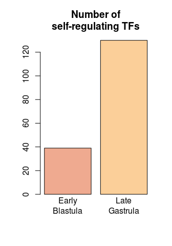

## About

In this markdown, we will analyse the networks of TF/target gene cis-regulatory interactinos generated using ANANSE.

We will load these networks as tabular data that we will transform into `igraph` graph objects, that we can parse and annotate using our information on TF classes and other similar functional annotation that we have carried out over the course of this project.

## Load libraries


```r
library(DESeq2)
library(limma)
library(ComplexHeatmap)
library(circlize)
library(ggplot2)
library(igraph)
```

## Load functions


```r
source("code/r_code/r_functions/sourcefolder.R")

sourceFolder(
  "code/r_code/r_functions",
  recursive = TRUE
  )

sourceFolder(
  "code/r_code/r_general",
  recursive = TRUE
  )
```

## Load previous Data

We will need some of the information we have generated in our previous analyses such as stage-specific cluster information and Transcription factor annotation.


```r
# RNA clusters
load("outputs/rda/stage_specific_clusters.rda")

# Transcription Factor information
load("outputs/rda/TF_annotation.rda")
```

## Load and prepare information for graph analysis

Here we will load all the remaining information of our interest and we will transform it into a format compliant to some of the functions we have made to annotate the graphs; basically, tabular data with gene id <--> annotation category.


```r
# Transcription factors

allTFclasses_col <- c(topclasses_col,otherclasses_col)

pfla_tfs_graph_analysis <-
  merge(
    pfla_tfs,
    data.frame(
      TFclass = 
        c(names(topclasses_col),names(otherclasses_col)),
      col = 
        c(topclasses_col,otherclasses_col)
      ),
    by.x = 2,
    by.y = 1
  )[,c(2,1,3)]

colnames(pfla_tfs_graph_analysis) <- c("id","TFclass","col")

# Effector genes
pfla_tfeg <- data.frame(
  id = allgenes,
  TFEG = ifelse(allgenes %in% pfla_tfs$id, "TF", "EG")
)

# Functional categories (COG)
pfla_funcat <- read.table(
  "outputs/functional_annotation/COGs/pfla_cogs.tsv",
  col.names = c("id","funcat")
)

# Trans-developmental / housekeeping
pfla_td_nohk <- 
  unique(
    read.table(
      "outputs/functional_annotation/TD_annotation/transdev_expanded_nohk.tsv",
      header=F,
      stringsAsFactors = F)[,1]
    )

pfla_hk_notd <- 
  unique(
    read.table(
      "outputs/functional_annotation/TD_annotation/housekeep_expanded_notd.tsv",
      header=F,
      stringsAsFactors=F)[,1]
    )

pfla_tdhk <- data.frame(
  id = allgenes,
  TDHK =  
    ifelse(allgenes %in% pfla_td_nohk, "td",
    ifelse(allgenes %in% pfla_hk_notd, "hk", 
    "none")
    )
  )

#Insitu Hybridisation data
pfla_ISH <- read.delim2(
  "outputs/functional_annotation/germlayers_ISH/in_situ_data.tsv",
  header = TRUE
)[,c(1:4)]
```

Finally, we add them into a list that our function for annotation will iterate through. We will call this the **list of attributes**


```r
pfla_attributes_list <- 
  list(
    pfla_tfeg,
    pfla_tfs_graph_analysis,
    pfla_funcat,
    pfla_tdhk,
    pfla_ISH
    )
```

We will also load the GO annotation of Ptychodera to use it later on in the functions.


```r
#gene universe
gene_universe <- allgenes

# gene-GO mappings
pfla_id_GO <-
  readMappings(
    "outputs/functional_annotation/go_blast2go/GO_annotation.txt"
  )
```

Likewise, we will also load the EggNOG annotation of gene names for more clarity in the plots of the graphs.


```r
pfla_genenames <-
  read.delim2(
    file = "outputs/functional_annotation/eggnog/emapper.annotations",
    skip = 3,
    header = TRUE
  )[,c(1,5,13)]
pfla_genenames <- pfla_genenames[pfla_genenames$predicted_gene_name != "",]
```

## Load ANANSE outputs

Here we will use the function `LoadNetworkData` that reads the .network file replacing instances of em dash and other ANANSE-related quirks. The resulting dataframe has three columns: "tf" (transcription factor), "tg" (target gene), and "prob" (probability). We manually add back underscores to the gene ids because ANANSE required the gene ids in a different format.

We do this for both the Early Blastula (EB) and Late Gastrula (LG) networks.


```r
# EARLY BLASTULA
pfla_EB_nw <- LoadNetworkData("outputs/ananse/pfla_EB.network")
```

```
## Warning in readLines(x): incomplete final line found on
## 'outputs/ananse/pfla_EB.network'
```

```r
pfla_EB_nw$tf <- gsub("TCONS", "TCONS_", pfla_EB_nw$tf)
pfla_EB_nw$tg <- gsub("TCONS", "TCONS_", pfla_EB_nw$tg)

# LATE GASTRULA
pfla_LG_nw <- LoadNetworkData("outputs/ananse/pfla_LG.network")
pfla_LG_nw$tf <- gsub("TCONS", "TCONS_", pfla_LG_nw$tf)
pfla_LG_nw$tg <- gsub("TCONS", "TCONS_", pfla_LG_nw$tg)
```

Here it is what it looks like.


```r
head(pfla_EB_nw)
```

```
##                tf             tg       prob
## 1: TCONS_00000165 TCONS_00000001 0.13640409
## 2: TCONS_00000165 TCONS_00000003 0.11046195
## 3: TCONS_00000165 TCONS_00000004 0.10880337
## 4: TCONS_00000165 TCONS_00000006 0.09827907
## 5: TCONS_00000165 TCONS_00000007 0.09742769
## 6: TCONS_00000165 TCONS_00000008 0.17221461
```

## Early Blastula

The first thing we will do is filter the network and keep only those interactions whose values are in the top 5% percentile. We will use this later on to quantify and measure the In- and Out-Degree of each gene, among other things.


```r
pfla_EB_nw2 <- FilterNetwork(pfla_EB_nw,q=0.95)
```

```
## [1] "Original network is 35854 genes. Filtered network is 8256 genes."
```

We generate an `igraph` object using our custom wrapper `GenerateNetwork` that also filter by the same number of interactions, since we provide `q = 0.95`.


```r
pfla_EB_graph <- GenerateNetwork(pfla_EB_nw,q = 0.95)
```

Using our list of attributes, we add this information to all the pertinent nodes (== genes) of our network using our ParseNetwork function.


```r
pfla_EB_parsenetwork <- ParseNetwork(pfla_EB_graph, pfla_attributes_list)
```

The resulting object can be subsetted to extract the new network with attributes on one object and the data frame of attributes on the other.


```r
pfla_EB_graph2 <- pfla_EB_parsenetwork[[1]]
pfla_EB_df_attr <- pfla_EB_parsenetwork[[2]]
```

The data frame of attributes is a data.frame object sorted in the same order as nodes are indexed in the igraph object. The content of this data frame is, for every node that has an attribute, a row with the id of this node, the index of this node, and a bunch of attributes (color, whether it is a trans-developmental gene, TF class, functional category, etc.)


```r
head(pfla_EB_df_attr)
```

```
##               id index TFEG         TFclass             col funcat TDHK
## 1 TCONS_00001049     1   TF           T-box         #f38d97      K none
## 2 TCONS_00001141     2   TF         C2H2_ZF         #ffebb5      K none
## 3 TCONS_00001174     3   TF            Runt lightgoldenrod2      Z none
## 4 TCONS_00001304     4   TF         C2H2_ZF         #ffebb5      O   td
## 5 TCONS_00001709     5   TF     Homeodomain         #5a5a82        none
## 6 TCONS_00001951     6   TF Homeodomain_POU         #a55297      K none
##   germlayer germlayer_col gene
## 1                             
## 2                             
## 3                             
## 4                             
## 5                             
## 6
```

Finally, we use our wrapper `NetworkStats`.

This wrapper performs a number of calculations using our igraph object and the tabular data frame, including also the gene ontology of target genes, and also reports the top central genes, the centrality of different kinds of genes by attribute (e.g. centrality of genes by TF class).

The inputs of the function are:

  - nw: the network represented as a tabular factor/target/prob
  - graph: the igraph object representing the network
  - att: a data frame containing information about the nodes of the network (e.g., the gene class, the gene function category, etc.)
  - N: the number of top nodes to select
  - C: a parameter to select the connected component of the graph to analyze
  - gene_universe: the universe of genes to consider in the gene ontology (GO) analysis
  - id2go: a mapping between gene IDs and GO IDs

The function outputs a list containing various statistics and metrics of the network, such as the number of genes, the number of active TFs, the top emitters and receivers of the network, the number of self-regulated TFs, the size of the connected components of the graph, the centrality of the TFs and the functional categories, and the gene ontology information.


```r
pfla_EB_stats <- NetworkStats(pfla_EB_nw2, pfla_EB_graph2, pfla_EB_df_attr, N = 10, gene_universe = gene_universe, id2go = pfla_id_GO)
```

```
## [1] "Basic Stats"
## [1] "Components"
## [1] "13"
## [1] "Centrality and category-based metrics"
## [1] "Centrality"
## [1] "Centrality of TFs"
## [1] "Centrality of Trans-Devs"
## [1] "Edges of Functional Categories"
## [1] "Centrality of Functional Categories"
## [1] "Getting Gene Ontology"
## [1] "Starting analysis 1 of 5"
```

```
## Warning in rev(-log(as.numeric(allres_x$classicFisher[1:maxgenesplot]) * : NAs
## introduced by coercion
```

```
## [1] "Starting analysis 2 of 5"
```

```
## Warning in rev(-log(as.numeric(allres_x$classicFisher[1:maxgenesplot]) * : NAs
## introduced by coercion
```

```
## [1] "Starting analysis 3 of 5"
```

```
## Warning in getSigGroups(object, test.stat): No enrichment can pe performed -
## there are no feasible GO terms!
```

```
## [1] "Starting analysis 4 of 5"
```

```
## Warning in rev(-log(as.numeric(allres_x$classicFisher[1:maxgenesplot]) * : NAs
## introduced by coercion
```

```
## [1] "Starting analysis 5 of 5"
```

```
## Warning in rev(-log(as.numeric(allres_x$classicFisher[1:maxgenesplot]) * : NAs
## introduced by coercion
```

```
## [1] "Generating output"
```

## Late Gastrula

Next we do the same for the Late Gastrula Network. We start by filtering the Network:


```r
pfla_LG_nw2 <- FilterNetwork(pfla_LG_nw,q=0.95)
```

```
## [1] "Original network is 35854 genes. Filtered network is 8543 genes."
```

Then we also generate an `igraph` network using the same percentile.


```r
pfla_LG_graph <- GenerateNetwork(pfla_LG_nw,q = 0.95)
```

We parse this graph using our list of attributes


```r
pfla_LG_parsenetwork <- ParseNetwork(pfla_LG_graph, pfla_attributes_list)

pfla_LG_graph2 <- pfla_LG_parsenetwork[[1]]
pfla_LG_df_attr <- pfla_LG_parsenetwork[[2]]
```

And finally we calculate the stats and metrics of this network:


```r
pfla_LG_stats <- NetworkStats(pfla_LG_nw2, pfla_LG_graph2, pfla_LG_df_attr, N = 10, gene_universe = gene_universe, id2go = pfla_id_GO)
```

```
## [1] "Basic Stats"
## [1] "Components"
## [1] "24"
## [1] "Centrality and category-based metrics"
## [1] "Centrality"
## [1] "Centrality of TFs"
## [1] "Centrality of Trans-Devs"
## [1] "Edges of Functional Categories"
## [1] "Centrality of Functional Categories"
## [1] "Getting Gene Ontology"
## [1] "Starting analysis 1 of 5"
```

```
## Warning in rev(-log(as.numeric(allres_x$classicFisher[1:maxgenesplot]) * : NAs
## introduced by coercion
```

```
## [1] "Starting analysis 2 of 5"
```

```
## Warning in rev(-log(as.numeric(allres_x$classicFisher[1:maxgenesplot]) * : NAs
## introduced by coercion
```

```
## [1] "Starting analysis 3 of 5"
```

```
## Warning in getSigGroups(object, test.stat): No enrichment can pe performed -
## there are no feasible GO terms!
```

```
## [1] "Starting analysis 4 of 5"
```

```
## Warning in rev(-log(as.numeric(allres_x$classicFisher[1:maxgenesplot]) * : NAs
## introduced by coercion
```

```
## [1] "Starting analysis 5 of 5"
```

```
## Warning in rev(-log(as.numeric(allres_x$classicFisher[1:maxgenesplot]) * : NAs
## introduced by coercion
```

```
## [1] "Generating output"
```

## Comparing the networks

We will have a look at the output of these wrappers a bit later. We will now compare these two networks using the NetworkStats and the filtered tab-format networks that we have generated.

Part of this comparison involves defining a subset of genes of interest, which we load here.


```r
genes_postgr <- 
  rownames(pfla_rna_dev)[
    pfla_rna_dev$cID > 12
    ]
```

And another part is loading the results of running ANANSE influence, which takes into account differential gene expression to infer the responsible factors for changes in the networks of cis-regulatory interactions between two states (in our case, the transition from early blastula to late gastrula).


```r
ananse_EB_to_LG <- 
  read.table("outputs/ananse/influence_LG_EB.tsv",header=T) #change this path

ananse_EB_to_LG$factor <-
  sub("TCONS","TCONS_",ananse_EB_to_LG$factor)
```

The `compareNetworks` wrapper compares two networks, nw_a and nw_b, and their respective graphs, graph_a and graph_b, and outputs various metrics, visualizations, and data frames.

The function requires the following arguments:

  - `nw_a`: A data frame or network object for network A.
  - `nw_b`: A data frame or network object for network B.
  - `graph_a`: A graph object for network A.
  - `graph_b`: A graph object for network B.
  - `stats_a`: A list of statistics for network A. Generated using NetworkStats() as explained above.
  - `stats_b`: A list of statistics for network B. Generated using NetworkStats() as explained above.
  - `influence`: if present, it outputs subgraphs of, and visualisations of, the top factors explaining the transition (as estimated by ANANSE influence).
  - `name_network_a`: The name of network A. The default is "a".
  - `name_network_b`: The name of network B. The default is "b".
  - `col_a`: The color of network A in the Venn diagram. The default is "darkorange".
  - `col_b`: The color of network B in the Venn diagram. The default is "purple".
  - `geneset_interest`: if present, it compares the percentage of a set of genes of interest as targets in each of the networks.
  - `top`: The proportion of top targets in each network to consider. The default is 0.9.
  - `tfs`: Not used in the function.
  - `gene_universe`: A vector of all genes.
  - `id2go`: A data frame containing gene ontology (GO) annotations.

The function performs the following tasks:

  - Identifies the exclusive and common targets in each network, and creates a Venn diagram of the targets.
  - Determines the GO terms for the exclusive and common targets and returns the topGO Fisher's test (elim method vs the whole set of ptychodera genes)
  - Calculates various metrics for the two networks, such as the number of genes, active transcription factors (TFs), connections per TF and target gene (TG), and self-regulated TFs, and creates a data frame of the calculated metrics.
  - Merges the InVsOut (In-degree vs. Out-degree) behavior of genes in both networks.
  - Calculates the centrality of common genes in both networks, and creates a data frame of the centrality metrics.
  - Calculates the centrality of TFs in both networks, and creates a data frame of the centrality metrics.
  - Calculates the centrality of trans-dev (trans-developmental) genes in both networks, and creates a data frame of the centrality metrics.
  - It generates sub-graphs of each of the networks, with the transcription factors found to have differences in centrality between each network.
  - Some of the output plots are:
   - barplots of the metrics,
   - venn diagram of shared target genes across networks,
   - scatter plots of centrality of common genes across networks, including TFs, and trans-dev genes,
   - plots of foldchanges of centrality of genes across networks, including TFs, and trans-dev genes,
   - plots of foldchanges of in-outdegree gene behavior across networks,
   - sub-graphs of top central tfs on each network,
   - scatter plot of top factors from ANANSE influence,
   - sub graph of the network b factor using the top factors from ANANSE influence.


```r
pdf(file = "graphics/EB_LG_comparenetworks.pdf",he=8,wi=10)
EB_vs_LG <- compareNetworks(
  name_network_a = "EB",
  name_network_b = "LG",
  nw_a = pfla_EB_nw2,
  nw_b = pfla_LG_nw2,
  top = 0.9,
  stats_a = pfla_EB_stats,
  stats_b = pfla_LG_stats,
  graph_a = pfla_EB_graph2,
  graph_b = pfla_LG_graph2,
  influence = ananse_EB_to_LG,
  tfs = pfla_tfs_graph_analysis,
  geneset_interest = genes_postgr,
  id2go = pfla_id_GO,
  gene_universe = gene_universe,
  col_a = "#efaa90",
  col_b = "#fbcf99"
)
```

```
## [1] "Defining exclusive and common targets"
## [1] "getting GO terms"
## [1] "Starting analysis 1 of 3"
## [1] "Starting analysis 2 of 3"
## [1] "Starting analysis 3 of 3"
## [1] "Dataframe of various metrics"
## [1] "Gene Behaviour across networks"
## [1] "Gene centrality of ALL common genes across networks"
## [1] "Gene centrality of TFs across networks"
## [1] "Gene centrality of trans-dev genes across networks"
## [1] "Graph generation - TF genes"
## [1] "Graph generation - Trans-dev genes"
## [1] "Plots"
## [1] "Mean connections per TF gene"
```

```
## [1] "Number of self-regulating TFs"
```

```
## [1] "connections per target gene"
```

```
## [1] "Venn Diagram Plot"
```

```
## [1] "Number of genes of interest in targets"
```

```
## [1] "Gene Behaviour plot"
```

```
## [1] "Gene Behaviour Box plot"
```

```
## [1] "Changes in centrality for ALL genes"
```

```
## [1] "Changes in centrality for TF genes"
```

```
## [1] "Foldchange in centrality of TFs"
```

```
## [1] "graph plots of TFs that change"
```

```
## [1] "Changes in trans-dev centrality across networks"
```

```
## [1] "Foldchange % emitted connections per gene"
```

```
## [1] "graph plots of trans-dev that change"
```

```
## [1] "Influence"
```

```
## [1] "Influence graph"
```

```
## Warning in length(vattrs[[name]]) <- vc: length of NULL cannot be changed
```

```
## [1] "Plot influence graph"
```

```r
dev.off()
```

```
## png 
##   2
```


## Network plots

We will now explore the graph analyses by plotting and visualising. We will define the constants of colors.


```r
col_a = "#efaa90"
col_b = "#fbcf99"
```

We start by having a look at the number of genes and the number of TFs in each network:


```r
barplot(
  as.data.frame(t(EB_vs_LG$comparison_table[,2:3]))[,1],
  main = "Number of Genes per Network",
  names.arg = c("EB","LG"),
  col = c(col_a,col_b),
  )
```

<!-- -->

Despite their similar size, we start to see differences just by checking how many TFs are in each graph.


```r
barplot(
  c(
    pfla_EB_stats$num_active_TFs,
    pfla_LG_stats$num_active_TFs
    ),
  main = "Number of TFs in each network",
  col = c(col_a,col_b),
  names.arg = c("EB","LG")
)
```

<!-- -->


Then we look at the number of connections per target gene. This is done by counting the number of instances of each gene in the "target" column of the tabular networks.


```r
# num connections per target gene
boxplot(
  main = "connections per\ntarget gene",
  list(
    c(EB_vs_LG$connections_per_tgt_gene$connects_per_tgt_gene_a),
    c(EB_vs_LG$connections_per_tgt_gene$connects_per_tgt_gene_b)
  ),
  names = c("\nEarly\nBlastula", "\nLate\nGastrula"),
  col = c(col_a,col_b),
  sub = paste0(
    "Wilcox p.value ",
    wilcox.test(
      x = c(EB_vs_LG$connections_per_tgt_gene$connects_per_tgt_gene_a),
      y = c(EB_vs_LG$connections_per_tgt_gene$connects_per_tgt_gene_b)
    )$p.value
  )
)
```

<!-- -->

We can also have a look at the number of TFs that are self-regulated on each network by counting the number of times a given TF gene appears as a target of itself in the tabular networks.


```r
# Number of self-reg TFs
barplot(
  main = "Number of\nself-regulating TFs",
  height = c(
    EB_vs_LG$comparison_table$a[EB_vs_LG$comparison_table$metric == "Num Self-Regulated TFs"],
    EB_vs_LG$comparison_table$b[EB_vs_LG$comparison_table$metric == "Num Self-Regulated TFs"]
  ),
  names.arg = c("Early\nBlastula", "Late\nGastrula"),
  col = c(col_a,col_b),
)
```

<!-- -->


For this we can look at the changes in centrality for different genes across networks.


```r
# plots of correlation changes in centrality tfs and transdev
par(mfrow = c(1,2))
plot(
  main = "Changes in TF centrality across networks",
  x = EB_vs_LG$tf_centrality_across_networks$a,
  y = EB_vs_LG$tf_centrality_across_networks$b,
  xlab = "Early Blastula",
  ylab = "Late Gastrula",
  pch = 19,
  cex = 0.75,
  col = alpha("#E58745",0.25)
)

plot(
  main = "Foldchange in centrality of TFs",
  sort(
    EB_vs_LG$tf_centrality_across_networks$b /
    EB_vs_LG$tf_centrality_across_networks$a
    ),
  col = alpha("#E58745",0.5),
  ylab = "foldchange centrality"
)
```

<!-- -->

```r
par(mfrow = c(1,1))
```

In this case we see a large number of genes tend to acquire higher levels of centrality in LG compared to EB, as shown in the scatter plot and the plot of the foldchange.

And the same about trans-dev genes:


```r
par(mfrow = c(1,2))
# same in transdev
plot(
  main = "Changes in trans-dev centrality across networks",
  x = EB_vs_LG$transdev_centrality_across_networks$a,
  y = EB_vs_LG$transdev_centrality_across_networks$b,
  xlab="Early Blastula",
  ylab = "Late Gastrula",
  pch = 19,
  cex = 0.75,
  col = alpha("#1A9A83",0.25)
)

plot(
  main = "Foldchange in centrality of trans-devs",
  sort(
    EB_vs_LG$transdev_centrality_across_networks$b /
      EB_vs_LG$transdev_centrality_across_networks$a
  ),
  col = alpha("#1A9A83",0.5),
  ylab = "foldchange centrality"
)
```

<!-- -->

```r
par(mfrow = c(1,1))
```

This is also reflected at the relative out-degree of genes, what we call "gene behaviour", and how it changes between networks. This can be visualised as cumulative density functions and/or boxplots.


```r
eb_inout_ratio <- 
  pfla_EB_stats$In_Out_per_Gene$ratio[
    pfla_EB_stats$In_Out_per_Gene$ratio > 0
    ]

lg_inout_ratio <- 
  pfla_LG_stats$In_Out_per_Gene$ratio[
    pfla_LG_stats$In_Out_per_Gene$ratio > 0
  ]

plot(
  seq(1:length(eb_inout_ratio)),
  eb_inout_ratio,
  main = "Relative outdegree",
  col = col_a,
  type = "l",
  xlab = "",
  ylab = "% emitting connections",
  lwd = 2,
  ylim = c(0,1)
)

lines(
  seq(1:79),
  lg_inout_ratio[1:79],
  col = col_b,
  lwd = 2
)
```

<!-- -->

To have a better idea of what kind are the genes affected by these networks, and since we saw that there is a TF switch at the transcriptional level during development (see previous markdowns), we can showcase the changes in the network structure by looking at the centrality of the different genes by TF class.

In this case we use the function `plot_centrailty_TFclass` that grabs a named list with teh centrality values of TF genes grouped by class and creates a barplot. Colors are assigned based on the named vector with TFclasses and color.


```r
## Centrality per TF class

par(mfrow = c(2,1))
plot_centrality_TFclass(
  s = pfla_EB_stats$Centrality_per_TFclass,
  f = allTFclasses_col,
  # sub_s = topclasses,
  main = "Centrality per TF Class - EB",
  ylim = c(0.00005,0.00012)
)

plot_centrality_TFclass(
  s = pfla_LG_stats$Centrality_per_TFclass,
  f = allTFclasses_col,
  # sub_s = topclasses,
  main = "Centrality per TF Class - LG",
  ylim = c(0.00005,0.00012)
)
```

<!-- -->

```r
par(mfrow = c(1,1))
```

How different are these networks at the target level? We can dig into this by looking at how overlapped these networks are, and at the enriched GO terms in the exclusive and commonly-shared target genes of each network.


```r
# number of shared targets
x <- 
  list(
    EB = c(
      EB_vs_LG$target_genes$targets_common_ab,
      EB_vs_LG$target_genes$targets_exclusive_a
      ), 
    LG = c(
      EB_vs_LG$target_genes$targets_common_ab,
      EB_vs_LG$target_genes$targets_exclusive_b
      )
  )

# Helper function to display Venn diagram
display_venn <- function(x, ...){
  library(VennDiagram)
  grid.newpage()
  venn_object <- venn.diagram(x, filename = NULL, ...)
  grid.draw(venn_object)
}

# Display the plot directly in R:
display_venn(
  x,
  # Circles
  lwd = 2,
  lty = 'blank',
  fill = c(col_a, col_b),
  # Numbers
  cex = .9,
  fontface = "italic",
  # Set names
  category.names = c("EB" , "LG"),
  cat.cex = 1,
  cat.pos = 180,
  cat.fontface = "bold",
  cat.default.pos = "outer"
  )
```

<!-- -->

We can see there is a major switch-on of TFs! What are they doing and what genes are they regulating? Here we have the enriched GO terms for the target genes exclusive to EB, the target genes exclusive to LG, and the common ones.


```r
# GO barplots or just the words for them
plot_grid(
  EB_vs_LG$GOs_targets$GOplot$targets_exclusive_a,
  EB_vs_LG$GOs_targets$GOplot$targets_exclusive_b,
  EB_vs_LG$GOs_targets$GOplot$targets_common_ab
)
```

<!-- -->

Here the GO terms of the exclusive and common TFs of each network, using the totality of TFs as universe (for reference):


```r
pfla_nws_TFs_GOs <- getGOs(
  genelist = 
    list(
     TFs_EB = pfla_EB_nw2$tf[!(pfla_EB_nw2$tf %in% pfla_LG_nw2$tf)],
     TFs_LG = pfla_LG_nw2$tf[!(pfla_LG_nw2$tf %in% pfla_EB_nw2$tf)],
     TFs_common = pfla_LG_nw2$tf[pfla_LG_nw2$tf %in% pfla_EB_nw2$tf]
    ),
  gene2GO = pfla_id_GO,
  gene_universe = sort(unique(c(pfla_EB_nw2$tf,pfla_LG_nw2$tf))),
  alg = "elim"
)
```

```
## [1] "Starting analysis 1 of 3"
```

```
## 
## Building most specific GOs .....
```

```
## 	( 5896 GO terms found. )
```

```
## 
## Build GO DAG topology ..........
```

```
## 	( 5918 GO terms and 13543 relations. )
```

```
## 
## Annotating nodes ...............
```

```
## 	( 237 genes annotated to the GO terms. )
```

```
## 
## 			 -- Elim Algorithm -- 
## 
## 		 the algorithm is scoring 772 nontrivial nodes
## 		 parameters: 
## 			 test statistic: fisher
## 			 cutOff: 0.01
```

```
## 
## 	 Level 18:	1 nodes to be scored	(0 eliminated genes)
```

```
## 
## 	 Level 17:	2 nodes to be scored	(0 eliminated genes)
```

```
## 
## 	 Level 16:	3 nodes to be scored	(0 eliminated genes)
```

```
## 
## 	 Level 15:	5 nodes to be scored	(0 eliminated genes)
```

```
## 
## 	 Level 14:	8 nodes to be scored	(0 eliminated genes)
```

```
## 
## 	 Level 13:	14 nodes to be scored	(5 eliminated genes)
```

```
## 
## 	 Level 12:	24 nodes to be scored	(5 eliminated genes)
```

```
## 
## 	 Level 11:	35 nodes to be scored	(5 eliminated genes)
```

```
## 
## 	 Level 10:	57 nodes to be scored	(5 eliminated genes)
```

```
## 
## 	 Level 9:	75 nodes to be scored	(5 eliminated genes)
```

```
## 
## 	 Level 8:	86 nodes to be scored	(5 eliminated genes)
```

```
## 
## 	 Level 7:	106 nodes to be scored	(5 eliminated genes)
```

```
## 
## 	 Level 6:	116 nodes to be scored	(5 eliminated genes)
```

```
## 
## 	 Level 5:	112 nodes to be scored	(5 eliminated genes)
```

```
## 
## 	 Level 4:	73 nodes to be scored	(5 eliminated genes)
```

```
## 
## 	 Level 3:	38 nodes to be scored	(5 eliminated genes)
```

```
## 
## 	 Level 2:	16 nodes to be scored	(5 eliminated genes)
```

```
## 
## 	 Level 1:	1 nodes to be scored	(5 eliminated genes)
```

```
## [1] "Starting analysis 2 of 3"
```

```
## 
## Building most specific GOs .....
```

```
## 	( 5896 GO terms found. )
```

```
## 
## Build GO DAG topology ..........
```

```
## 	( 5918 GO terms and 13543 relations. )
```

```
## 
## Annotating nodes ...............
```

```
## 	( 237 genes annotated to the GO terms. )
```

```
## 
## 			 -- Elim Algorithm -- 
## 
## 		 the algorithm is scoring 5282 nontrivial nodes
## 		 parameters: 
## 			 test statistic: fisher
## 			 cutOff: 0.01
```

```
## 
## 	 Level 18:	3 nodes to be scored	(0 eliminated genes)
```

```
## 
## 	 Level 17:	9 nodes to be scored	(0 eliminated genes)
```

```
## 
## 	 Level 16:	26 nodes to be scored	(0 eliminated genes)
```

```
## 
## 	 Level 15:	54 nodes to be scored	(0 eliminated genes)
```

```
## 
## 	 Level 14:	109 nodes to be scored	(0 eliminated genes)
```

```
## 
## 	 Level 13:	187 nodes to be scored	(0 eliminated genes)
```

```
## 
## 	 Level 12:	301 nodes to be scored	(0 eliminated genes)
```

```
## 
## 	 Level 11:	453 nodes to be scored	(0 eliminated genes)
```

```
## 
## 	 Level 10:	609 nodes to be scored	(0 eliminated genes)
```

```
## 
## 	 Level 9:	716 nodes to be scored	(13 eliminated genes)
```

```
## 
## 	 Level 8:	733 nodes to be scored	(23 eliminated genes)
```

```
## 
## 	 Level 7:	719 nodes to be scored	(58 eliminated genes)
```

```
## 
## 	 Level 6:	616 nodes to be scored	(81 eliminated genes)
```

```
## 
## 	 Level 5:	419 nodes to be scored	(81 eliminated genes)
```

```
## 
## 	 Level 4:	215 nodes to be scored	(81 eliminated genes)
```

```
## 
## 	 Level 3:	92 nodes to be scored	(81 eliminated genes)
```

```
## 
## 	 Level 2:	20 nodes to be scored	(81 eliminated genes)
```

```
## 
## 	 Level 1:	1 nodes to be scored	(81 eliminated genes)
```

```
## [1] "Starting analysis 3 of 3"
```

```
## 
## Building most specific GOs .....
```

```
## 	( 5896 GO terms found. )
```

```
## 
## Build GO DAG topology ..........
```

```
## 	( 5918 GO terms and 13543 relations. )
```

```
## 
## Annotating nodes ...............
```

```
## 	( 237 genes annotated to the GO terms. )
```

```
## 
## 			 -- Elim Algorithm -- 
## 
## 		 the algorithm is scoring 3294 nontrivial nodes
## 		 parameters: 
## 			 test statistic: fisher
## 			 cutOff: 0.01
```

```
## 
## 	 Level 18:	1 nodes to be scored	(0 eliminated genes)
```

```
## 
## 	 Level 17:	3 nodes to be scored	(0 eliminated genes)
```

```
## 
## 	 Level 16:	12 nodes to be scored	(0 eliminated genes)
```

```
## 
## 	 Level 15:	37 nodes to be scored	(0 eliminated genes)
```

```
## 
## 	 Level 14:	66 nodes to be scored	(0 eliminated genes)
```

```
## 
## 	 Level 13:	113 nodes to be scored	(0 eliminated genes)
```

```
## 
## 	 Level 12:	173 nodes to be scored	(0 eliminated genes)
```

```
## 
## 	 Level 11:	261 nodes to be scored	(0 eliminated genes)
```

```
## 
## 	 Level 10:	339 nodes to be scored	(0 eliminated genes)
```

```
## 
## 	 Level 9:	407 nodes to be scored	(5 eliminated genes)
```

```
## 
## 	 Level 8:	452 nodes to be scored	(15 eliminated genes)
```

```
## 
## 	 Level 7:	451 nodes to be scored	(15 eliminated genes)
```

```
## 
## 	 Level 6:	415 nodes to be scored	(15 eliminated genes)
```

```
## 
## 	 Level 5:	307 nodes to be scored	(15 eliminated genes)
```

```
## 
## 	 Level 4:	162 nodes to be scored	(15 eliminated genes)
```

```
## 
## 	 Level 3:	76 nodes to be scored	(15 eliminated genes)
```

```
## 
## 	 Level 2:	18 nodes to be scored	(15 eliminated genes)
```

```
## 
## 	 Level 1:	1 nodes to be scored	(15 eliminated genes)
```

```r
plot_grid(
  pfla_nws_TFs_GOs$GOplot$TFs_EB,
  pfla_nws_TFs_GOs$GOplot$TFs_LG,
  pfla_nws_TFs_GOs$GOplot$TFs_common,
  ncol = 1
)
```

<!-- -->

And the same for the exclusive and common TFs of each network, just like previously computed --but again using the totality of TFs as universe for reference/comparison:


```r
pfla_nws_TGs_GOs <- getGOs(
  genelist = 
    list(
      TGs_EB = pfla_EB_nw2$tg[!(pfla_EB_nw2$tg %in% pfla_LG_nw2$tg)],
      TGs_LG = pfla_LG_nw2$tg[!(pfla_LG_nw2$tg %in% pfla_EB_nw2$tg)],
      TGs_common = pfla_LG_nw2$tg[pfla_LG_nw2$tg %in% pfla_EB_nw2$tg]
    ),
  gene2GO = pfla_id_GO,
  gene_universe = sort(unique(c(pfla_EB_nw2$tg,pfla_LG_nw2$tg))),
  alg = "elim"
)
```

```
## [1] "Starting analysis 1 of 3"
```

```
## 
## Building most specific GOs .....
```

```
## 	( 14294 GO terms found. )
```

```
## 
## Build GO DAG topology ..........
```

```
## 	( 14331 GO terms and 33145 relations. )
```

```
## 
## Annotating nodes ...............
```

```
## 	( 6715 genes annotated to the GO terms. )
```

```
## 
## 			 -- Elim Algorithm -- 
## 
## 		 the algorithm is scoring 6571 nontrivial nodes
## 		 parameters: 
## 			 test statistic: fisher
## 			 cutOff: 0.01
```

```
## 
## 	 Level 18:	1 nodes to be scored	(0 eliminated genes)
```

```
## 
## 	 Level 17:	8 nodes to be scored	(0 eliminated genes)
```

```
## 
## 	 Level 16:	29 nodes to be scored	(0 eliminated genes)
```

```
## 
## 	 Level 15:	56 nodes to be scored	(0 eliminated genes)
```

```
## 
## 	 Level 14:	119 nodes to be scored	(0 eliminated genes)
```

```
## 
## 	 Level 13:	207 nodes to be scored	(0 eliminated genes)
```

```
## 
## 	 Level 12:	373 nodes to be scored	(25 eliminated genes)
```

```
## 
## 	 Level 11:	599 nodes to be scored	(29 eliminated genes)
```

```
## 
## 	 Level 10:	824 nodes to be scored	(56 eliminated genes)
```

```
## 
## 	 Level 9:	972 nodes to be scored	(281 eliminated genes)
```

```
## 
## 	 Level 8:	936 nodes to be scored	(356 eliminated genes)
```

```
## 
## 	 Level 7:	877 nodes to be scored	(371 eliminated genes)
```

```
## 
## 	 Level 6:	738 nodes to be scored	(479 eliminated genes)
```

```
## 
## 	 Level 5:	467 nodes to be scored	(529 eliminated genes)
```

```
## 
## 	 Level 4:	234 nodes to be scored	(544 eliminated genes)
```

```
## 
## 	 Level 3:	108 nodes to be scored	(547 eliminated genes)
```

```
## 
## 	 Level 2:	22 nodes to be scored	(547 eliminated genes)
```

```
## 
## 	 Level 1:	1 nodes to be scored	(547 eliminated genes)
```

```
## [1] "Starting analysis 2 of 3"
```

```
## 
## Building most specific GOs .....
```

```
## 	( 14294 GO terms found. )
```

```
## 
## Build GO DAG topology ..........
```

```
## 	( 14331 GO terms and 33145 relations. )
```

```
## 
## Annotating nodes ...............
```

```
## 	( 6715 genes annotated to the GO terms. )
```

```
## 
## 			 -- Elim Algorithm -- 
## 
## 		 the algorithm is scoring 7735 nontrivial nodes
## 		 parameters: 
## 			 test statistic: fisher
## 			 cutOff: 0.01
```

```
## 
## 	 Level 19:	2 nodes to be scored	(0 eliminated genes)
```

```
## 
## 	 Level 18:	5 nodes to be scored	(0 eliminated genes)
```

```
## 
## 	 Level 17:	19 nodes to be scored	(0 eliminated genes)
```

```
## 
## 	 Level 16:	40 nodes to be scored	(0 eliminated genes)
```

```
## 
## 	 Level 15:	73 nodes to be scored	(46 eliminated genes)
```

```
## 
## 	 Level 14:	144 nodes to be scored	(55 eliminated genes)
```

```
## 
## 	 Level 13:	265 nodes to be scored	(89 eliminated genes)
```

```
## 
## 	 Level 12:	467 nodes to be scored	(129 eliminated genes)
```

```
## 
## 	 Level 11:	717 nodes to be scored	(190 eliminated genes)
```

```
## 
## 	 Level 10:	972 nodes to be scored	(464 eliminated genes)
```

```
## 
## 	 Level 9:	1104 nodes to be scored	(650 eliminated genes)
```

```
## 
## 	 Level 8:	1132 nodes to be scored	(753 eliminated genes)
```

```
## 
## 	 Level 7:	1029 nodes to be scored	(1026 eliminated genes)
```

```
## 
## 	 Level 6:	832 nodes to be scored	(1298 eliminated genes)
```

```
## 
## 	 Level 5:	548 nodes to be scored	(1728 eliminated genes)
```

```
## 
## 	 Level 4:	250 nodes to be scored	(2054 eliminated genes)
```

```
## 
## 	 Level 3:	113 nodes to be scored	(2145 eliminated genes)
```

```
## 
## 	 Level 2:	22 nodes to be scored	(2145 eliminated genes)
```

```
## 
## 	 Level 1:	1 nodes to be scored	(2150 eliminated genes)
```

```
## [1] "Starting analysis 3 of 3"
```

```
## 
## Building most specific GOs .....
```

```
## 	( 14294 GO terms found. )
```

```
## 
## Build GO DAG topology ..........
```

```
## 	( 14331 GO terms and 33145 relations. )
```

```
## 
## Annotating nodes ...............
```

```
## 	( 6715 genes annotated to the GO terms. )
```

```
## 
## 			 -- Elim Algorithm -- 
## 
## 		 the algorithm is scoring 13453 nontrivial nodes
## 		 parameters: 
## 			 test statistic: fisher
## 			 cutOff: 0.01
```

```
## 
## 	 Level 20:	1 nodes to be scored	(0 eliminated genes)
```

```
## 
## 	 Level 19:	4 nodes to be scored	(0 eliminated genes)
```

```
## 
## 	 Level 18:	14 nodes to be scored	(0 eliminated genes)
```

```
## 
## 	 Level 17:	41 nodes to be scored	(0 eliminated genes)
```

```
## 
## 	 Level 16:	97 nodes to be scored	(0 eliminated genes)
```

```
## 
## 	 Level 15:	178 nodes to be scored	(0 eliminated genes)
```

```
## 
## 	 Level 14:	358 nodes to be scored	(0 eliminated genes)
```

```
## 
## 	 Level 13:	629 nodes to be scored	(256 eliminated genes)
```

```
## 
## 	 Level 12:	1063 nodes to be scored	(489 eliminated genes)
```

```
## 
## 	 Level 11:	1499 nodes to be scored	(872 eliminated genes)
```

```
## 
## 	 Level 10:	1862 nodes to be scored	(1279 eliminated genes)
```

```
## 
## 	 Level 9:	1949 nodes to be scored	(2061 eliminated genes)
```

```
## 
## 	 Level 8:	1820 nodes to be scored	(3125 eliminated genes)
```

```
## 
## 	 Level 7:	1580 nodes to be scored	(3748 eliminated genes)
```

```
## 
## 	 Level 6:	1202 nodes to be scored	(4066 eliminated genes)
```

```
## 
## 	 Level 5:	672 nodes to be scored	(5021 eliminated genes)
```

```
## 
## 	 Level 4:	337 nodes to be scored	(5115 eliminated genes)
```

```
## 
## 	 Level 3:	124 nodes to be scored	(5134 eliminated genes)
```

```
## 
## 	 Level 2:	22 nodes to be scored	(5174 eliminated genes)
```

```
## 
## 	 Level 1:	1 nodes to be scored	(5174 eliminated genes)
```

```r
plot_grid(
  pfla_nws_TFs_GOs$GOplot$TGs_EB,
  pfla_nws_TFs_GOs$GOplot$TGs_LG,
  pfla_nws_TFs_GOs$GOplot$TGs_common,
  ncol = 1
)
```

<!-- -->

Another way to check for differences between target genes in networks is looking at the presence of certain genes of interest in each. For example, we can check how many genes of larval development are being targeted in each of the networks. We see there is a large different in the proportion of larval genes that are embedded in the LG network compared to the EB network. This is hinting at the aforementioned switch towards larval development already taking place at the cis-regulatory level during gastrulation.


```r
# number of post-gastrulation genes in network

barplot(
  main="Post-gastrulation genes\nin network",
  height=c(
    EB_vs_LG[[11]][1]/length(EB_vs_LG$target_genes$targets_exclusive_a)*100,
    EB_vs_LG[[11]][2]/length(EB_vs_LG$target_genes$targets_exclusive_b)*100
  ),
  col = c(
    col_a,
    col_b
  ),
  names=c("EB", "LG"),
  ylab="gene percent",
  ylim = c(0,65),
  las=1
)
```

<!-- -->

Here we can see what are the functional categories of the genes whose relative out-degree (number of outgoing vs incoming connections) change between stages. Here we see that signal transduction has a small increase only in gastrulation.


```r
funcat_EB <- plot_behavior_per_category2(pfla_EB_stats, use_log = TRUE, main = "number of genes with above minimum relative out-degree,\nper functional category (EB)")
funcat_LG <- plot_behavior_per_category2(pfla_LG_stats, use_log = TRUE, main = "number of genes with above minimum relative out-degree,\nper functional category (LG)")

plot_grid(
  funcat_EB,
  funcat_LG,
  ncol = 1
)
```

<!-- -->

Finally, to check the differences between the networks of these developmental stages, we can use the output of ANANSE influence to check for the top factors. Below we re-run the code used to generate the influence plot in `compareNetworks()`.


```r
# influence
influ_tbl <- ananse_EB_to_LG 
influ_tbl <- merge(influ_tbl,pfla_tfs_graph_analysis,by.x=1,by.y=1,all.x=T)
influ_tbl$TFclass[is.na(influ_tbl$TFclass)] <- " "
influ_tbl$col[is.na(influ_tbl$col)] <- "gray"
influ_tbl <- influ_tbl [rev(order(influ_tbl$sumScaled)),]
rownames(influ_tbl) <- NULL

# 'translate' the gene ids to known gene names using a small function
influ_tbl$genename <- 
  translate_ids(x = influ_tbl$factor,dict = pfla_genenames)
```

Here the plot of ANANSE influence. Colors indicate different TF classes. Where available, gene names have been added.


```r
plot(
  influ_tbl$factor_fc,
  influ_tbl$sumScaled,
  pch=19,
  col=influ_tbl$col,
  bg="black",
  xlab="log2fold change of TF",
  ylab="ANANSE influence score",
  main="Main factors",
  bty="n",
  xlim=c(0,max(influ_tbl$factor_fc)+1)
)
text(
  influ_tbl$factor_fc[1:25],
  influ_tbl$sumScaled[1:25]+0.005,
  influ_tbl$genename[1:25],
  cex=0.7
)
```

<!-- -->

And here is the plot of the graph of these TFs:


```r
V(EB_vs_LG$influence_graph)$genename <- 
  translate_ids(V(EB_vs_LG$influence_graph)$name,pfla_genenames)

E(EB_vs_LG$influence_graph)$width <-
  category_by_quantile(
    E(EB_vs_LG$influence_graph)$prob,
    newvalues = c(0.2,1,2,5)
    )

set.seed(1234)
plot(
  main = "Influence network",
  EB_vs_LG$influence_graph,
  vertex.color = V(EB_vs_LG$influence_graph)$col,
  vertex.label = V(EB_vs_LG$influence_graph)$genename,
  edge.width = E(EB_vs_LG$influence_graph)$width,
  edge.arrow.size = 0.2,
  edge.color = rgb(0,0,0,0.1),
  layout = layout_with_lgl(EB_vs_LG$influence_graph)
)
```

<!-- -->

## Networks of germ layers

We were interested in knowing whether we can see interactions between genes which are expressed at specific germ layers. For this we crossed our data with in situ hybridisation data, and decided to sub-set the LG graph.

First we generate logicals to retrieve the genes that are expressed in ectodeerm, in mesoderm, and in endoderm respectively.


```r
ecto_genes <- which(
  V(pfla_LG_graph2)$germlayer== "Ectoderm")

meso_genes <- which(
  V(pfla_LG_graph2)$germlayer== "Mesoderm" |
  V(pfla_LG_graph2)$germlayer=="EctoMeso" |
  V(pfla_LG_graph2)$germlayer=="EndoMeso" |
  V(pfla_LG_graph2)$germlayer== "All" &
  V(pfla_LG_graph2)$name != "TCONS_00004384"# this gene is not connected to anything
)

endo_genes <- which(
  V(pfla_LG_graph2)$germlayer== "Endoderm" |
  V(pfla_LG_graph2)$germlayer=="EndoEcto" |
  V(pfla_LG_graph2)$germlayer=="EndoMeso" |
  V(pfla_LG_graph2)$germlayer== "All"
) 
```

We subsetted the LG graph


```r
#ectoderm
ecto_graph <- induced_subgraph(
  pfla_LG_graph2,
  vids = ecto_genes,
  impl = "auto"
)

V(ecto_graph)$genename <- translate_ids(x = V(ecto_graph)$name , dict = pfla_ISH[,c(1,4)])
ecto_graph$weight <- cut(E(ecto_graph)$width,breaks = quantile(E(ecto_graph)$width), include.lowest = TRUE, labels = FALSE)
V(ecto_graph)$col[V(ecto_graph)$col == ""] <- "lightgray"

#mesoderm
meso_graph <- induced_subgraph(
  pfla_LG_graph2,
  vids = meso_genes,
  impl = "auto"
)

V(meso_graph)$genename <- translate_ids(x = V(meso_graph)$name , dict = pfla_ISH[,c(1,4)])
meso_graph$weight <- cut(E(meso_graph)$width,breaks = quantile(E(meso_graph)$width), include.lowest = TRUE, labels = FALSE)
V(meso_graph)$col[V(meso_graph)$col == ""] <- "lightgray"

#endoderm
endo_graph <- induced_subgraph(
  pfla_LG_graph2,
  vids = endo_genes,
  impl = "auto"
)

V(endo_graph)$genename <- translate_ids(x = V(endo_graph)$name , dict = pfla_ISH[,c(1,4)])
endo_graph$weight <- cut(E(endo_graph)$width,breaks = quantile(E(endo_graph)$width), include.lowest = TRUE, labels = FALSE)
V(endo_graph)$col[V(endo_graph)$col == ""] <- "lightgray"
```

And finally we plot the graphs


```r
par(mfrow = c(3,1))
#ectoderm
plot(
  main = "Ectoderm graph",
  ecto_graph,
  vertex.color = V(ecto_graph)$germlayer_col,
  vertex.label = V(ecto_graph)$genename,
  vertex.size = 8,
  edge.width = ecto_graph$weight,
  edge.arrow.size = 0.2,
  edge.color = rgb(0,0,0,0.1),
  layout = layout_with_fr(ecto_graph)
)

#mesoderm
plot(
  main = "Mesoderm graph",
  meso_graph,
  vertex.color = V(meso_graph)$germlayer_col,
  vertex.label = V(meso_graph)$genename,
  vertex.size = 8,
  edge.width = meso_graph$weight,
  edge.arrow.size = 0.2,
  edge.color = rgb(0,0,0,0.1),
  layout = layout_with_fr(meso_graph)
)

#endoderm
plot(
  main = "Endoderm graph",
  endo_graph,
  vertex.color = V(endo_graph)$germlayer_col,
  vertex.label = V(endo_graph)$genename,
  vertex.size = 8,
  edge.width = endo_graph$weight,
  edge.arrow.size = 0.2,
  edge.color = rgb(0,0,0,0.1),
  layout = layout_with_fr(endo_graph)
)
```

<!-- -->

```r
par(mfrow = c(1,1))
```

Since we detected a relationship between centrality in the graph and expression ubiquity, we decided to see if these differences can also be detected at the gene annotation level by having a look at the GO terms of the TFs in LG, sorted and classified by their level of centrality in the graph.

First we retrieve the TFs and their values of centrality, and have a look at their distribution of values. 


```r
tfs_centr <- unlist(pfla_LG_stats$Centrality_per_TFclass[-51]) # remove non-TFs

names(tfs_centr) <- sub(".*TCONS_","TCONS_",names(tfs_centr))

plot(density(tfs_centr)) + abline(v=quantile(tfs_centr))
```

<!-- -->

```
## integer(0)
```

One possible approximation could be, as seen in the plot, by using quantiles. We will classify the TFs based on these quantiles, group them in a list, and do the GO term analysis.


```r
qs <- cut(tfs_centr, breaks = quantile(tfs_centr), labels = FALSE, include.lowest = TRUE)

grouped_tfs <- split(names(tfs_centr), qs)

names(grouped_tfs) <- c("low_central","low_mid","mid_high","high_central")

gos_by_tfcentr <- getGOs(
  genelist = grouped_tfs,
  gene_universe = names(tfs_centr),
  alg = "elim",
  gene2GO = pfla_id_GO
)
```

```
## [1] "Starting analysis 1 of 4"
```

```
## 
## Building most specific GOs .....
```

```
## 	( 6496 GO terms found. )
```

```
## 
## Build GO DAG topology ..........
```

```
## 	( 6519 GO terms and 14868 relations. )
```

```
## 
## Annotating nodes ...............
```

```
## 	( 383 genes annotated to the GO terms. )
```

```
## 
## 			 -- Elim Algorithm -- 
## 
## 		 the algorithm is scoring 2601 nontrivial nodes
## 		 parameters: 
## 			 test statistic: fisher
## 			 cutOff: 0.01
```

```
## 
## 	 Level 17:	1 nodes to be scored	(0 eliminated genes)
```

```
## 
## 	 Level 16:	9 nodes to be scored	(0 eliminated genes)
```

```
## 
## 	 Level 15:	18 nodes to be scored	(0 eliminated genes)
```

```
## 
## 	 Level 14:	41 nodes to be scored	(0 eliminated genes)
```

```
## 
## 	 Level 13:	70 nodes to be scored	(0 eliminated genes)
```

```
## 
## 	 Level 12:	122 nodes to be scored	(0 eliminated genes)
```

```
## 
## 	 Level 11:	183 nodes to be scored	(0 eliminated genes)
```

```
## 
## 	 Level 10:	271 nodes to be scored	(0 eliminated genes)
```

```
## 
## 	 Level 9:	322 nodes to be scored	(0 eliminated genes)
```

```
## 
## 	 Level 8:	335 nodes to be scored	(0 eliminated genes)
```

```
## 
## 	 Level 7:	363 nodes to be scored	(17 eliminated genes)
```

```
## 
## 	 Level 6:	348 nodes to be scored	(17 eliminated genes)
```

```
## 
## 	 Level 5:	267 nodes to be scored	(17 eliminated genes)
```

```
## 
## 	 Level 4:	157 nodes to be scored	(17 eliminated genes)
```

```
## 
## 	 Level 3:	72 nodes to be scored	(17 eliminated genes)
```

```
## 
## 	 Level 2:	21 nodes to be scored	(17 eliminated genes)
```

```
## 
## 	 Level 1:	1 nodes to be scored	(17 eliminated genes)
```

```
## [1] "Starting analysis 2 of 4"
```

```
## 
## Building most specific GOs .....
```

```
## 	( 6496 GO terms found. )
```

```
## 
## Build GO DAG topology ..........
```

```
## 	( 6519 GO terms and 14868 relations. )
```

```
## 
## Annotating nodes ...............
```

```
## 	( 383 genes annotated to the GO terms. )
```

```
## 
## 			 -- Elim Algorithm -- 
## 
## 		 the algorithm is scoring 3355 nontrivial nodes
## 		 parameters: 
## 			 test statistic: fisher
## 			 cutOff: 0.01
```

```
## 
## 	 Level 17:	6 nodes to be scored	(0 eliminated genes)
```

```
## 
## 	 Level 16:	14 nodes to be scored	(0 eliminated genes)
```

```
## 
## 	 Level 15:	28 nodes to be scored	(0 eliminated genes)
```

```
## 
## 	 Level 14:	55 nodes to be scored	(0 eliminated genes)
```

```
## 
## 	 Level 13:	90 nodes to be scored	(0 eliminated genes)
```

```
## 
## 	 Level 12:	168 nodes to be scored	(0 eliminated genes)
```

```
## 
## 	 Level 11:	268 nodes to be scored	(0 eliminated genes)
```

```
## 
## 	 Level 10:	355 nodes to be scored	(6 eliminated genes)
```

```
## 
## 	 Level 9:	442 nodes to be scored	(6 eliminated genes)
```

```
## 
## 	 Level 8:	462 nodes to be scored	(47 eliminated genes)
```

```
## 
## 	 Level 7:	470 nodes to be scored	(47 eliminated genes)
```

```
## 
## 	 Level 6:	422 nodes to be scored	(47 eliminated genes)
```

```
## 
## 	 Level 5:	309 nodes to be scored	(47 eliminated genes)
```

```
## 
## 	 Level 4:	164 nodes to be scored	(47 eliminated genes)
```

```
## 
## 	 Level 3:	81 nodes to be scored	(47 eliminated genes)
```

```
## 
## 	 Level 2:	20 nodes to be scored	(47 eliminated genes)
```

```
## 
## 	 Level 1:	1 nodes to be scored	(47 eliminated genes)
```

```
## [1] "Starting analysis 3 of 4"
```

```
## 
## Building most specific GOs .....
```

```
## 	( 6496 GO terms found. )
```

```
## 
## Build GO DAG topology ..........
```

```
## 	( 6519 GO terms and 14868 relations. )
```

```
## 
## Annotating nodes ...............
```

```
## 	( 383 genes annotated to the GO terms. )
```

```
## 
## 			 -- Elim Algorithm -- 
## 
## 		 the algorithm is scoring 4378 nontrivial nodes
## 		 parameters: 
## 			 test statistic: fisher
## 			 cutOff: 0.01
```

```
## 
## 	 Level 18:	3 nodes to be scored	(0 eliminated genes)
```

```
## 
## 	 Level 17:	9 nodes to be scored	(0 eliminated genes)
```

```
## 
## 	 Level 16:	25 nodes to be scored	(0 eliminated genes)
```

```
## 
## 	 Level 15:	50 nodes to be scored	(0 eliminated genes)
```

```
## 
## 	 Level 14:	90 nodes to be scored	(0 eliminated genes)
```

```
## 
## 	 Level 13:	139 nodes to be scored	(0 eliminated genes)
```

```
## 
## 	 Level 12:	238 nodes to be scored	(0 eliminated genes)
```

```
## 
## 	 Level 11:	354 nodes to be scored	(50 eliminated genes)
```

```
## 
## 	 Level 10:	474 nodes to be scored	(348 eliminated genes)
```

```
## 
## 	 Level 9:	568 nodes to be scored	(348 eliminated genes)
```

```
## 
## 	 Level 8:	618 nodes to be scored	(348 eliminated genes)
```

```
## 
## 	 Level 7:	607 nodes to be scored	(348 eliminated genes)
```

```
## 
## 	 Level 6:	532 nodes to be scored	(348 eliminated genes)
```

```
## 
## 	 Level 5:	373 nodes to be scored	(349 eliminated genes)
```

```
## 
## 	 Level 4:	193 nodes to be scored	(350 eliminated genes)
```

```
## 
## 	 Level 3:	84 nodes to be scored	(352 eliminated genes)
```

```
## 
## 	 Level 2:	20 nodes to be scored	(356 eliminated genes)
```

```
## 
## 	 Level 1:	1 nodes to be scored	(356 eliminated genes)
```

```
## [1] "Starting analysis 4 of 4"
```

```
## 
## Building most specific GOs .....
```

```
## 	( 6496 GO terms found. )
```

```
## 
## Build GO DAG topology ..........
```

```
## 	( 6519 GO terms and 14868 relations. )
```

```
## 
## Annotating nodes ...............
```

```
## 	( 383 genes annotated to the GO terms. )
```

```
## 
## 			 -- Elim Algorithm -- 
## 
## 		 the algorithm is scoring 4123 nontrivial nodes
## 		 parameters: 
## 			 test statistic: fisher
## 			 cutOff: 0.01
```

```
## 
## 	 Level 18:	1 nodes to be scored	(0 eliminated genes)
```

```
## 
## 	 Level 17:	2 nodes to be scored	(0 eliminated genes)
```

```
## 
## 	 Level 16:	11 nodes to be scored	(0 eliminated genes)
```

```
## 
## 	 Level 15:	45 nodes to be scored	(0 eliminated genes)
```

```
## 
## 	 Level 14:	82 nodes to be scored	(0 eliminated genes)
```

```
## 
## 	 Level 13:	153 nodes to be scored	(0 eliminated genes)
```

```
## 
## 	 Level 12:	218 nodes to be scored	(212 eliminated genes)
```

```
## 
## 	 Level 11:	346 nodes to be scored	(212 eliminated genes)
```

```
## 
## 	 Level 10:	458 nodes to be scored	(218 eliminated genes)
```

```
## 
## 	 Level 9:	534 nodes to be scored	(243 eliminated genes)
```

```
## 
## 	 Level 8:	537 nodes to be scored	(244 eliminated genes)
```

```
## 
## 	 Level 7:	561 nodes to be scored	(252 eliminated genes)
```

```
## 
## 	 Level 6:	515 nodes to be scored	(264 eliminated genes)
```

```
## 
## 	 Level 5:	365 nodes to be scored	(300 eliminated genes)
```

```
## 
## 	 Level 4:	193 nodes to be scored	(301 eliminated genes)
```

```
## 
## 	 Level 3:	82 nodes to be scored	(306 eliminated genes)
```

```
## 
## 	 Level 2:	19 nodes to be scored	(306 eliminated genes)
```

```
## 
## 	 Level 1:	1 nodes to be scored	(306 eliminated genes)
```

```r
plot_grid(
  gos_by_tfcentr$GOplot$low_central,
  gos_by_tfcentr$GOplot$low_mid,
  gos_by_tfcentr$GOplot$mid_high,
  gos_by_tfcentr$GOplot$high_central,
  ncol = 2
)
```

<!-- -->

## Save the Data

We will save the data now:


```r
save(
  # Attributes
  pfla_attributes_list,
  pfla_tfs_graph_analysis,
  pfla_tdhk,
  pfla_tfeg,
  pfla_funcat,
  # Early Blastula
  pfla_EB_nw,
  pfla_EB_nw2,
  pfla_EB_parsenetwork,
  pfla_EB_graph,
  pfla_EB_graph2,
  pfla_EB_stats,
  # Late Gastrula
  pfla_LG_nw,
  pfla_LG_nw2,
  pfla_LG_parsenetwork,
  pfla_LG_graph,
  pfla_LG_graph2,
  pfla_LG_stats,
  # Network comparison
  EB_vs_LG,
  file = "outputs/rda/graph_analysis.rda"
)
```
